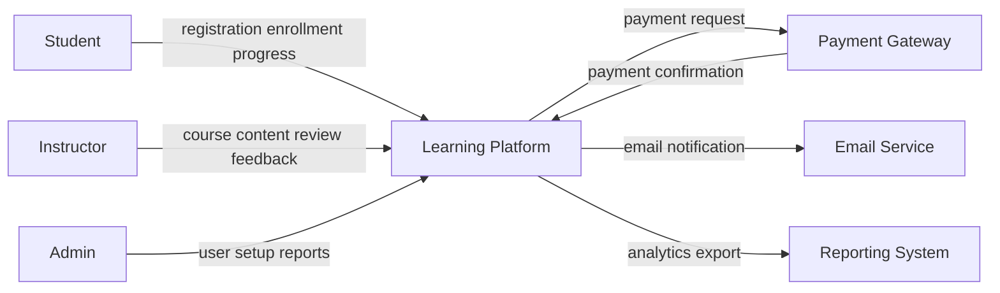
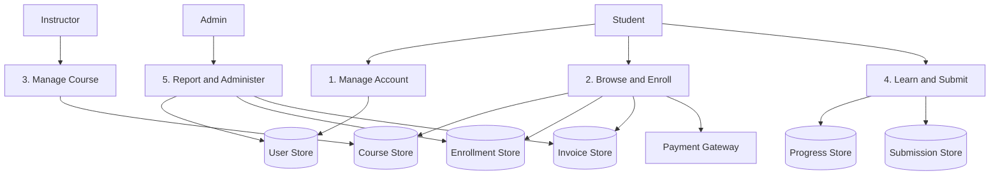
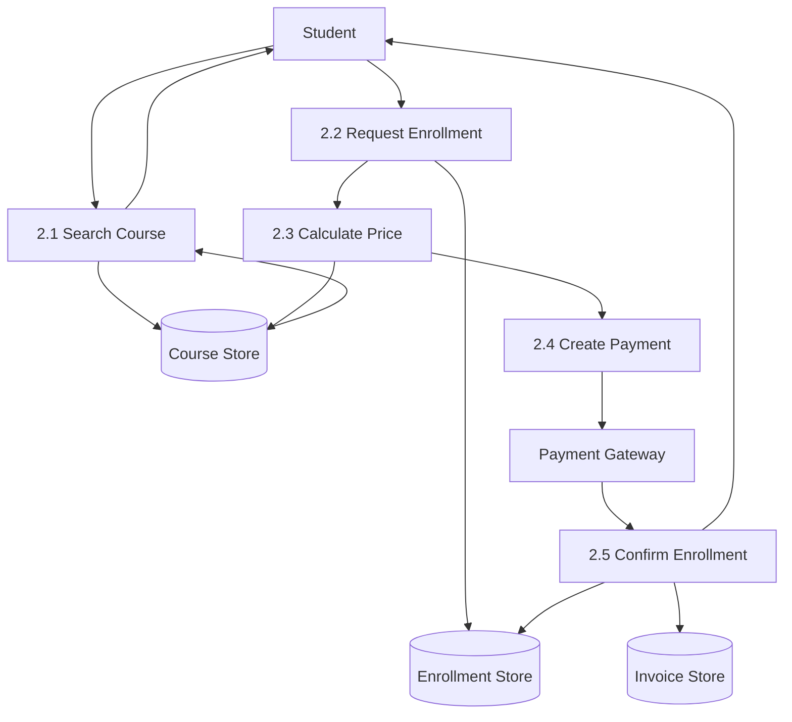

# DFD Context, Level 0, and Level 1

## Learning Objective
By the end of this lesson, you will create Data Flow Diagrams from context level to Level 1, showing external entities, processes, data stores, and data movement without confusing them with database schemas or architecture diagrams.

## What is a DFD?
A Data Flow Diagram shows how data moves through a system. It focuses on data input, processing, storage, and output.

It answers:
- Where does data come from?
- Which process changes it?
- Where is it stored?
- Who receives the result?
- Which external systems exchange data?

## DFD Building Blocks
- External Entity: user or external system outside the boundary
- Process: transforms data
- Data Store: stored data
- Data Flow: movement of data

## DFD Context Diagram
A context diagram shows the whole system as one process.

## DFD Level 0
Level 0 breaks the system into major processes and data stores.

## DFD Level 1
Level 1 expands one Level 0 process into more detail.

Example: expand `2. Browse and Enroll`.

## DFD vs ERD vs Architecture

| Artifact | Focus |
| --- | --- |
| DFD | Movement and transformation of data |
| ERD | Data entities and relationships |
| Schema | Physical database structure |
| Architecture Diagram | Modules, services, infrastructure, communication |
| Sequence Diagram | Message order for one scenario |

## Step-by-Step DFD Process
1. Identify external entities.
2. Draw context diagram with the system as one process.
3. Identify major internal processes.
4. Identify data stores.
5. Draw Level 0.
6. Choose high-risk processes.
7. Expand those into Level 1.
8. Validate every input and output.
9. Check that parent and child diagrams balance.
10. Review with business and technical teams.

## Balancing Rule
If data enters or leaves a process in Level 0, the same data should appear in the matching Level 1 expansion. This keeps diagrams consistent.

## Senior-Level Usage
Use DFDs when:
- The system has many data handoffs.
- You need to explain reporting flows.
- You need to find missing storage.
- You need to discuss privacy and compliance.
- You need to analyze integrations.

Do not use DFDs as a replacement for deployment architecture. A data store in a DFD does not always equal one database server.

## Common Mistakes
- Showing control flow instead of data flow.
- Drawing UI pages as processes.
- Drawing database tables instead of data stores.
- Mixing infrastructure nodes into DFD.
- Creating Level 1 diagrams for everything.
- Not balancing Level 0 and Level 1.

## DFD Checklist
- External entities are outside the system.
- Processes use verb phrases.
- Data stores use noun phrases.
- Data flows have meaningful labels.
- Context diagram is simple.
- Level 0 shows major processes.
- Level 1 expands only selected processes.
- Data stores match important business data.
- Parent and child diagrams are balanced.

## Practice Task
Create DFD Context, Level 0, and Level 1 for an online payment checkout.

Include:
- Customer
- Payment gateway
- Order store
- Payment store
- Inventory store
- Notification service
- Checkout process
- Payment confirmation process

## Interview and Design Review Questions
- Which external entity sends the most critical data?
- Which process changes financial data?
- Which data store is the source of truth?
- What data crosses a trust boundary?
- Which flow needs audit logging?

## Summary
DFDs help senior developers understand data movement before architecture decisions become too technical. Context, Level 0, and Level 1 diagrams move from big picture to detailed data transformation.
