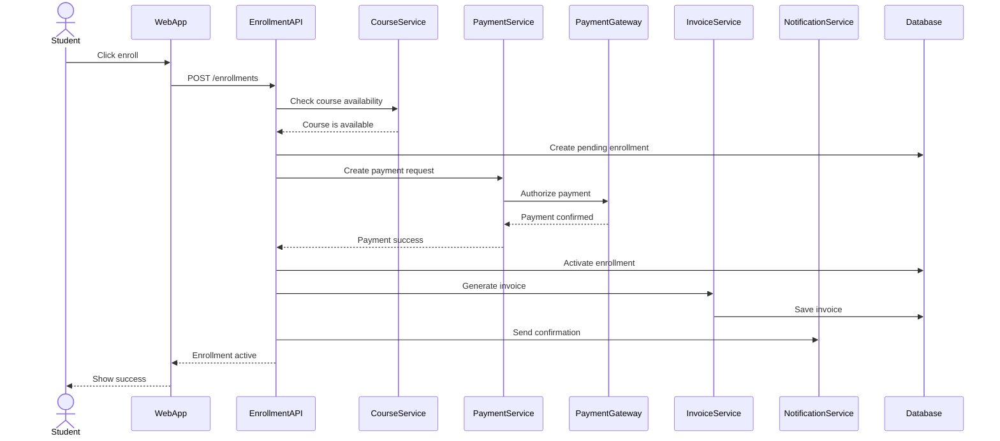
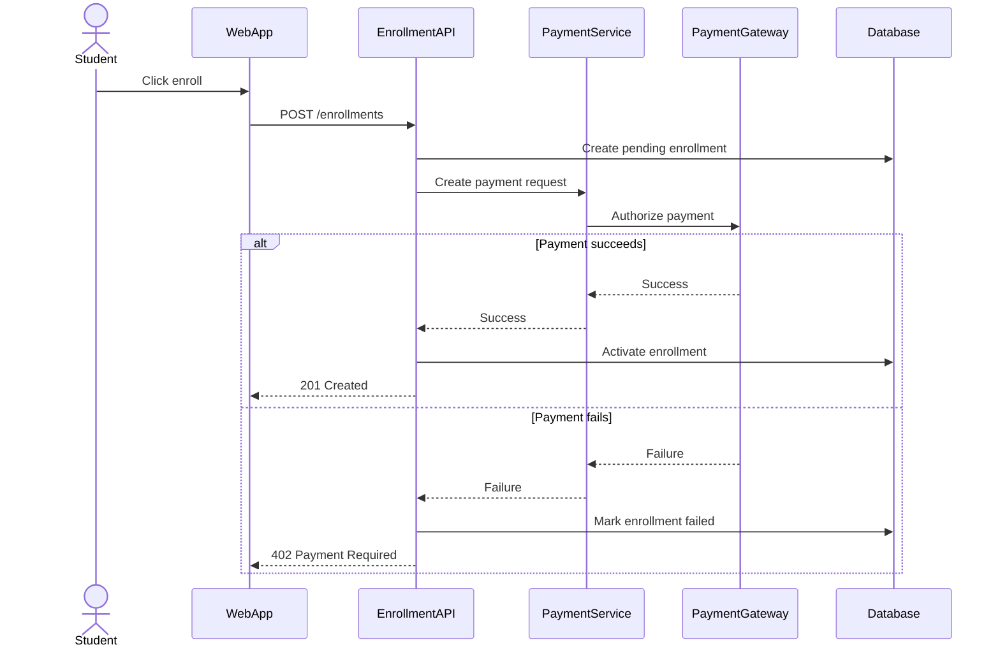

# Sequence, API, and Integration Design

## Learning Objective
By the end of this lesson, you will design runtime interactions using sequence diagrams, API contracts, integration boundaries, error flows, retries, idempotency, and synchronous versus asynchronous communication.

## What is a Sequence Diagram?
A sequence diagram shows the order of messages between actors, services, modules, databases, and external systems for one scenario.

It answers:
- Who calls whom?
- In what order?
- Which data is passed?
- Where is validation done?
- Where are transactions started?
- What happens on failure?

## Sequence Diagram Example: Paid Course Enrollment



## Add Failure Paths
Senior sequence diagrams should not hide failure.



## API Design
APIs expose capabilities to clients and other systems.

Good API design includes:
- Resource names
- HTTP methods
- Request body
- Response body
- Status codes
- Validation rules
- Error format
- Authentication and authorization
- Rate limits
- Idempotency strategy
- Versioning

## API Contract Example
Endpoint: `POST /api/enrollments`

Purpose: Create a course enrollment request.

Request:

```json
{
  "courseId": 101,
  "paymentMethodId": "pm_123",
  "couponCode": "SPRING25"
}
```

Success response:

```json
{
  "enrollmentId": 9001,
  "status": "active",
  "invoiceId": 7001
}
```

Error response:

```json
{
  "errorCode": "PAYMENT_FAILED",
  "message": "Payment could not be completed",
  "correlationId": "req_abc123"
}
```

## Synchronous vs Asynchronous Communication

| Style | Use When | Risk |
| --- | --- | --- |
| Synchronous API | Caller needs immediate response | Timeout chains |
| Message Queue | Work can happen later | Eventual consistency |
| Event Streaming | Many consumers need business events | More operational complexity |
| Webhook | External system notifies your system | Retry and verification needed |

## Idempotency
Idempotency means repeating the same request does not create duplicate side effects.

For payment and enrollment:
- Client sends `Idempotency-Key`.
- Server stores processed key.
- Duplicate request returns the same result.
- Prevents double enrollment and double charge.

## Retry Strategy
Retries are necessary for network failure, but dangerous for non-idempotent operations.

Senior retry design includes:
- Timeout
- Retry count
- Exponential backoff
- Dead-letter queue for async messages
- Idempotency key
- Monitoring and alerting

## Integration Boundary Questions
Ask:
- Is the external system reliable?
- What is the timeout?
- Can we retry safely?
- Is the operation idempotent?
- What data must be logged?
- What happens if our database commits but the external call fails?
- What happens if the external call succeeds but our database update fails?

## Common Mistakes
- Sequence diagram only shows success.
- API has vague error messages.
- Payment operation is not idempotent.
- External system timeout is not defined.
- Retry creates duplicate records.
- No correlation ID for debugging.
- API leaks database table design.

## Checklist
- Sequence diagram covers success and failure.
- Important APIs have request and response examples.
- Status codes are meaningful.
- Error response format is consistent.
- Authorization is clear.
- Idempotency is defined for unsafe operations.
- Retry rules are documented.
- External integrations have timeout and fallback behavior.
- Logs include correlation IDs.

## Practice Task
Design a sequence diagram and API contract for assignment submission.

Include:
- Student submits assignment.
- API validates deadline.
- File is stored.
- Submission row is created.
- Instructor receives notification.
- Duplicate submit is handled.
- Late submission returns a clear error.

## Interview and Design Review Questions
- What happens if the user clicks submit twice?
- What happens if file upload succeeds but database insert fails?
- What is the timeout for the payment gateway?
- Which APIs need rate limits?
- Which errors should the client retry?

## Summary
Sequence diagrams and API contracts turn architecture into runtime behavior. Senior designs include failure paths, idempotency, retry rules, and integration boundaries, not only happy-path calls.
