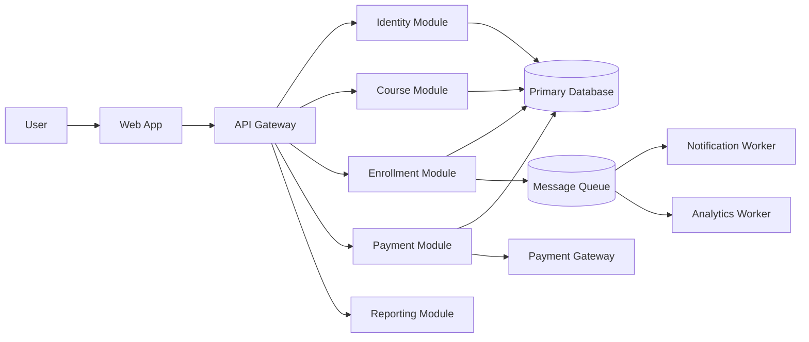

# HLD, System Design, and Architecture

## Learning Objective
By the end of this lesson, you will create a High Level Design that explains system scope, modules, data ownership, integrations, non-functional requirements, scalability, reliability, security, and architecture decisions.

## What is HLD?
HLD means High Level Design. It describes the system from an architecture and module perspective.

HLD answers:
- What are the major components?
- What does each component own?
- How do components communicate?
- What data stores are used?
- What external systems are integrated?
- How does the system scale?
- How does the system fail and recover?
- What are the main tradeoffs?

## HLD vs LLD

| HLD | LLD |
| --- | --- |
| Big picture | Implementation detail |
| Modules and services | Classes, functions, interfaces |
| Architecture decisions | Method behavior and validation |
| Data ownership | Table fields and object models |
| Deployment view | Code structure |
| Non-functional requirements | Error handling and algorithms |

## HLD Document Structure
A senior HLD document usually includes:
1. Problem statement
2. Goals and non-goals
3. Requirements
4. Assumptions
5. Constraints
6. Architecture overview
7. Component responsibilities
8. Data ownership
9. API and integration overview
10. Scalability plan
11. Reliability plan
12. Security plan
13. Observability plan
14. Deployment view
15. Alternatives considered
16. Risks and open questions

## HLD Example: Learning Platform

## Component Responsibility Table

| Component | Responsibility | Owns Data? |
| --- | --- | --- |
| Identity Module | login, roles, permissions | users, roles |
| Course Module | course catalog, lessons | courses, lessons |
| Enrollment Module | enrollment lifecycle | enrollments |
| Payment Module | payment requests and status | payments, invoices |
| Notification Worker | email and async messages | notification logs |
| Reporting Module | dashboards and exports | read models |

## Non-Functional Requirements
HLD must include non-functional requirements.

Examples:
- Availability: 99.9% monthly uptime
- Latency: course catalog under 300 ms for cached pages
- Throughput: 500 enrollment requests per minute
- Security: role-based access control and encrypted sensitive data
- Recovery: database backup restore tested monthly
- Observability: logs, metrics, traces, and alerts

## Scalability Design
Scale only what needs scaling.

Common techniques:
- Cache read-heavy data.
- Add indexes for frequent queries.
- Use queues for slow background tasks.
- Horizontally scale stateless web/API servers.
- Separate reporting reads from transactional writes.
- Partition large tables when needed.
- Use CDN for static assets and media.

## Reliability Design
Reliability asks what happens when something fails.

Plan for:
- Database failure
- Payment gateway timeout
- Queue backlog
- Email provider outage
- Deployment failure
- Cache outage
- Region outage if business requires it

## Security Design
Security must be part of HLD, not an afterthought.

Include:
- Authentication
- Authorization
- Role-based access control
- Data encryption
- Audit logging
- Secure secrets management
- Rate limiting
- Input validation
- Dependency review
- Backup protection

## Observability Design
Production systems need visibility.

Include:
- Structured logs
- Metrics
- Distributed tracing
- Health checks
- Error tracking
- Audit logs
- Dashboards
- Alerts
- Runbooks

## Architecture Decision Record
Use short decision records for important choices.

Template:
- Decision
- Context
- Options considered
- Chosen option
- Reason
- Consequences
- Review date

## Senior-Level Tradeoffs
- Microservices improve independent deployment but increase distributed complexity.
- Caching improves performance but creates invalidation problems.
- Queues improve resilience but introduce eventual consistency.
- Strong consistency simplifies correctness but may reduce availability.
- Shared databases are simple early but can block service independence later.

## Common Mistakes
- HLD only shows boxes, no responsibilities.
- No non-functional requirements.
- No alternatives or tradeoffs.
- No failure design.
- No data ownership.
- No security or observability.
- Design is too detailed and becomes LLD.

## HLD Checklist
- Problem and scope are clear.
- Goals and non-goals are listed.
- Major modules are visible.
- Responsibilities are documented.
- Data ownership is clear.
- External integrations are shown.
- Key APIs are identified.
- Scalability, reliability, security, and observability are covered.
- Deployment view exists.
- Tradeoffs and risks are included.

## Practice Task
Create an HLD for an online exam system.

Include:
- Architecture diagram
- Components
- Data stores
- External integrations
- Non-functional requirements
- Scaling plan
- Failure handling
- Security concerns

## Interview and Design Review Questions
- Which module owns which data?
- What is the biggest bottleneck?
- What happens if the payment provider is down?
- What is strongly consistent?
- What can be eventually consistent?
- Which component is stateless?
- How will you monitor the system?

## Summary
HLD is the bridge between business understanding and technical implementation. A senior HLD explains architecture decisions, not only architecture pictures.
