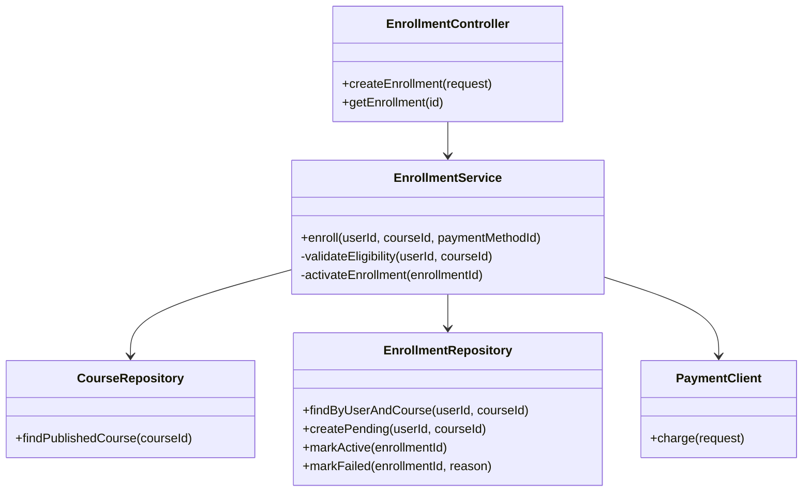
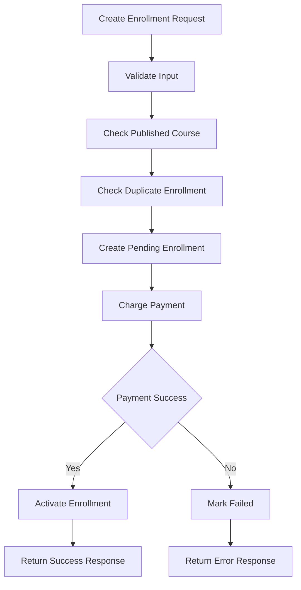

# LLD Low Level Design

## Learning Objective
By the end of this lesson, you will create Low Level Design that translates HLD into implementation-ready modules, classes, APIs, validation rules, error handling, persistence behavior, and testable responsibilities.

## What is LLD?
LLD means Low Level Design. It explains how a selected part of the system will be built.

LLD answers:
- Which classes or modules are needed?
- Which methods and interfaces are exposed?
- What validation rules are applied?
- What data is read and written?
- What errors can occur?
- What transaction boundary is used?
- What tests are needed?

## When to Create LLD
Create LLD for:
- Complex business rules
- Payment logic
- Approval workflows
- Inventory updates
- Pricing and discount rules
- Authentication and authorization logic
- Integrations with retries
- High-risk database operations

Do not write deep LLD for every simple CRUD screen.

## LLD Example: Enrollment Module



## LLD Flow



## LLD Document Structure
1. Feature scope
2. Inputs and outputs
3. Class or module diagram
4. Method responsibilities
5. Validation rules
6. Business rules
7. Data access rules
8. Transaction boundary
9. Error handling
10. Logging and audit
11. Security checks
12. Test cases

## Interface Design
Interfaces hide implementation details and make modules testable.

Example:

```text
PaymentClient
- charge(amount, currency, paymentMethodId, idempotencyKey)
- refund(paymentId, reason)
```

The Enrollment module should not know how the payment provider works internally. It only depends on a stable contract.

## Transaction Boundary
Define what must be committed together.

For enrollment:
- Creating pending enrollment can be committed before payment.
- Payment call is external and should not hold a database transaction open.
- Activating enrollment happens after payment success.
- Failed payment should mark enrollment as failed.

## Error Handling
Design errors explicitly.

Examples:
- `COURSE_NOT_FOUND`
- `COURSE_NOT_PUBLISHED`
- `ALREADY_ENROLLED`
- `PAYMENT_FAILED`
- `PAYMENT_TIMEOUT`
- `VALIDATION_ERROR`

Each error should have:
- Code
- Message
- HTTP status if API-facing
- Retry behavior
- Logging level

## Validation Rules
Validation belongs at multiple levels:
- Request validation: required fields and data types
- Business validation: course published, user eligible
- Authorization validation: user can enroll
- Persistence validation: unique constraints
- Integration validation: payment provider response verified

## Senior-Level Tradeoffs
- Thin controllers improve testability.
- Domain logic should not live only in UI.
- Repository methods should express business intent, not expose random queries everywhere.
- Too many abstractions can slow development.
- Too few abstractions can create tightly coupled code.
- External calls should be isolated behind clients or adapters.

## Common Mistakes
- LLD repeats HLD without implementation detail.
- Business logic is hidden in controllers.
- Transaction boundaries are unclear.
- Duplicate request behavior is not defined.
- Error handling is generic.
- Test cases are missing.
- Method names describe database operations instead of business intent.

## LLD Checklist
- Scope is small and clear.
- Classes/modules have single responsibilities.
- Inputs and outputs are defined.
- Business rules are listed.
- Validation is layered.
- Transaction boundary is documented.
- Errors are named.
- External calls are isolated.
- Test cases cover success, failure, duplicate request, and permission errors.

## Practice Task
Create an LLD for assignment submission.

Include:
- Controller
- Service
- Repository
- File storage client
- Notification client
- Validation rules
- Error codes
- Transaction boundary
- Test cases

## Interview and Design Review Questions
- Where does business logic live?
- What happens if the external storage upload succeeds but database insert fails?
- What is the transaction boundary?
- Which methods are unit tested?
- Which errors are retryable?
- Which dependency should be mocked?

## Summary
LLD turns architecture into code-ready design. Senior LLD is precise enough for implementation but still focused on responsibilities, rules, and risks instead of language-specific noise.
