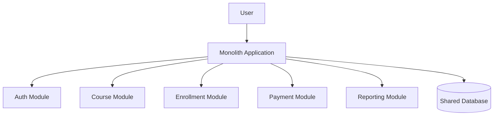
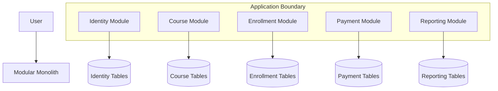
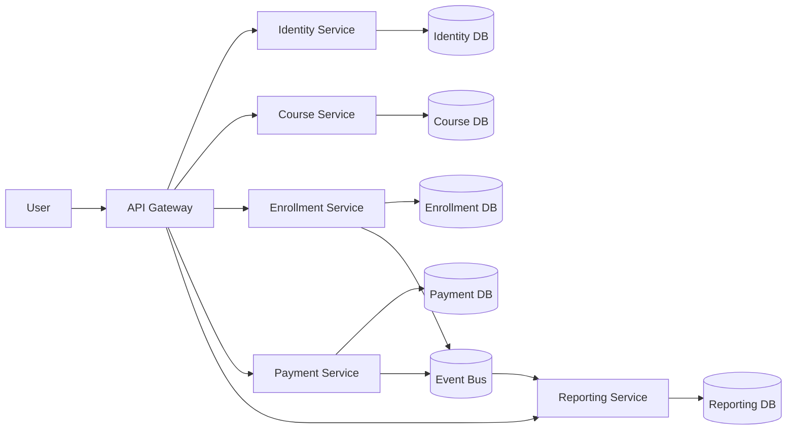
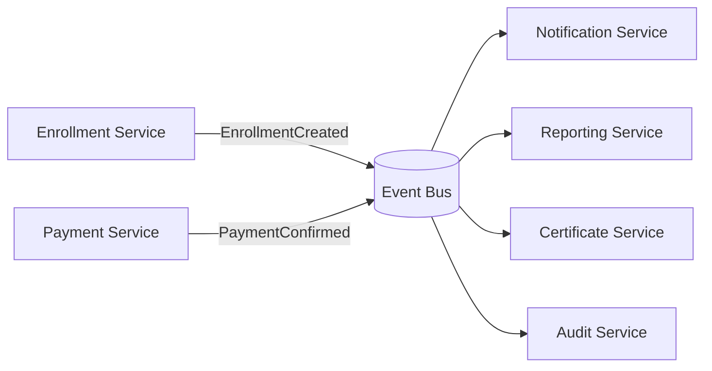
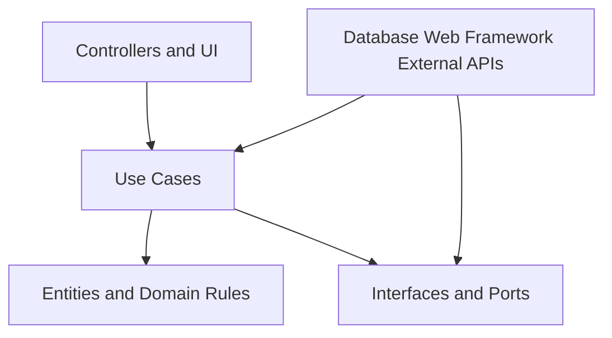

# Architecture Styles: Monolith, Modular Monolith, Microservice, Event Driven, and Clean Architecture

## Learning Objective
By the end of this lesson, you will understand major architecture styles, when to use each one, how to draw them, and how senior developers choose architecture based on team, domain, scale, deployment, and operational maturity.

## What is Architecture Style?
An architecture style is a high-level structure for organizing software. It defines how code, data, modules, services, and dependencies are arranged.

Choosing architecture is choosing tradeoffs.

## Monolith Diagram
A monolith is one deployable application containing all major features.

## Monolith Strengths
- Simple deployment
- Easier local development
- Simple transactions
- Easier debugging
- Lower operational cost
- Good for small teams and early products

## Monolith Risks
- Code can become tangled.
- One deployment can affect everything.
- Scaling is coarse-grained.
- Team boundaries may be unclear.
- Long-term maintainability can suffer without discipline.

## Modular Monolith Diagram
A modular monolith is one deployable application with strong internal module boundaries.

## Modular Monolith Strengths
- Keeps deployment simple.
- Preserves strong module ownership.
- Easier to refactor into services later.
- Reduces distributed-system complexity.
- Good default for many business systems.

## Modular Monolith Rules
- Modules own their data.
- Modules expose interfaces.
- Cross-module database access is restricted.
- Domain logic stays inside the module.
- Shared code is small and stable.
- Dependencies are reviewed.

## Microservice Diagram
Microservices split the system into independently deployable services.

## Microservice Strengths
- Independent deployment
- Independent scaling
- Clear service ownership
- Technology flexibility
- Fault isolation when designed well
- Useful for large teams and complex domains

## Microservice Risks
- Network calls can fail.
- Distributed transactions are hard.
- Observability is more complex.
- Testing is harder.
- Data consistency becomes harder.
- DevOps maturity is required.
- Too many services can slow development.

## Event Driven Diagram
Event-driven architecture uses business events to decouple producers and consumers.

## Event Driven Strengths
- Decouples services.
- Supports async processing.
- Helps scale background work.
- Enables multiple consumers.
- Good for notifications, reporting, audit, and integrations.

## Event Driven Risks
- Eventual consistency.
- Duplicate events.
- Message ordering issues.
- Harder debugging.
- Schema evolution.
- Dead-letter queue management.

## Clean Architecture Diagram
Clean Architecture organizes code so business rules do not depend on frameworks, databases, or UI.

## Clean Architecture Rules
- Domain rules are independent.
- Use cases coordinate business actions.
- Controllers adapt HTTP/UI into use case calls.
- Repositories implement interfaces.
- Frameworks are details.
- Tests can run without real infrastructure.

## Choosing the Right Architecture

| Situation | Good Choice |
| --- | --- |
| Small team, early product | Monolith |
| Growing system with clear domains | Modular monolith |
| Large teams with independent ownership | Microservices |
| Many async side effects | Event driven |
| Complex business rules | Clean architecture inside modules |
| Heavy reporting and integration | Event driven plus read models |

## Senior-Level Tradeoffs
- Monolith is not bad. Bad boundaries are bad.
- Microservices do not automatically create scalability.
- Modular monolith is often the best transition architecture.
- Event-driven design needs idempotent consumers.
- Clean architecture adds structure but can become over-engineered if used blindly.
- Architecture should match team maturity, not only technical ambition.

## Migration Path
A practical growth path:
1. Start with a monolith.
2. Refactor into a modular monolith.
3. Add events for async side effects.
4. Extract services only where independent deployment or scaling is truly needed.
5. Add API gateway, service observability, and CI/CD maturity before many microservices.

## Common Mistakes
- Starting with microservices before understanding the domain.
- Sharing one database across many microservices.
- Letting modules bypass their interfaces.
- Treating events as commands.
- Ignoring duplicate event handling.
- Adding clean architecture layers without business complexity.
- Choosing architecture because it is popular.

## Architecture Checklist
- Business capabilities are identified.
- Module boundaries are clear.
- Data ownership is clear.
- Deployment unit is intentional.
- Communication style is documented.
- Failure modes are understood.
- Team ownership matches architecture.
- Observability plan exists.
- Testing strategy fits the architecture.
- Migration path is realistic.

## Practice Task
Take the learning platform and draw three versions:
- Monolith
- Modular monolith
- Microservice architecture

For each version, write:
- Benefits
- Risks
- Data ownership
- Deployment strategy
- When you would choose it

## Interview and Design Review Questions
- Why not start with microservices?
- Which module should be extracted first?
- How do services share data?
- What happens when an event is delivered twice?
- Which architecture is easiest for your current team?
- What is the cost of your chosen architecture?

## Summary
Architecture style is a strategic decision. Senior developers choose the simplest architecture that supports the business, team, scale, and operational needs while leaving a safe path for growth.
