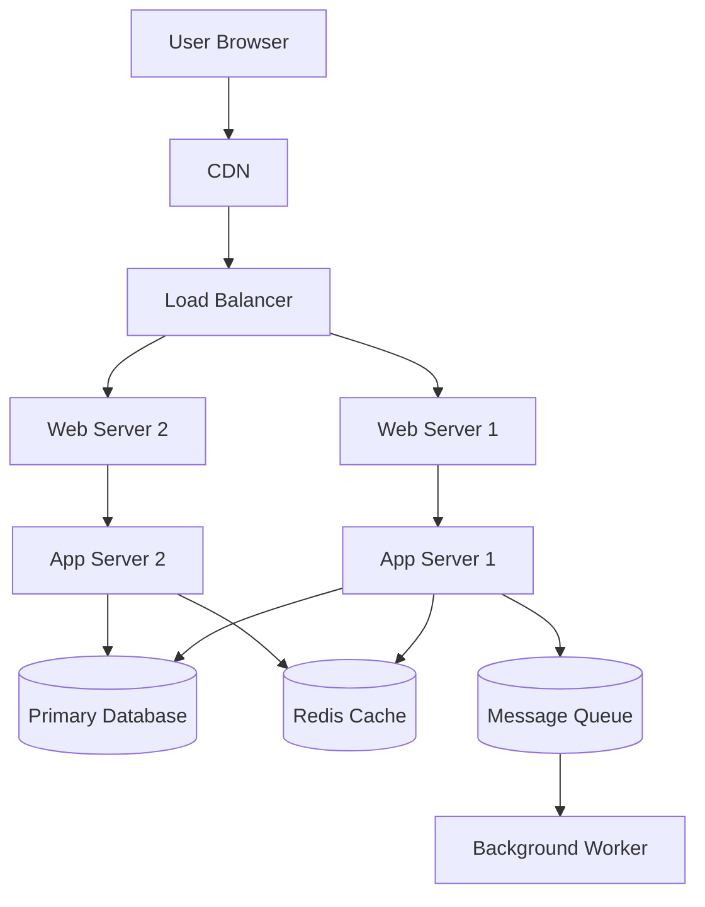
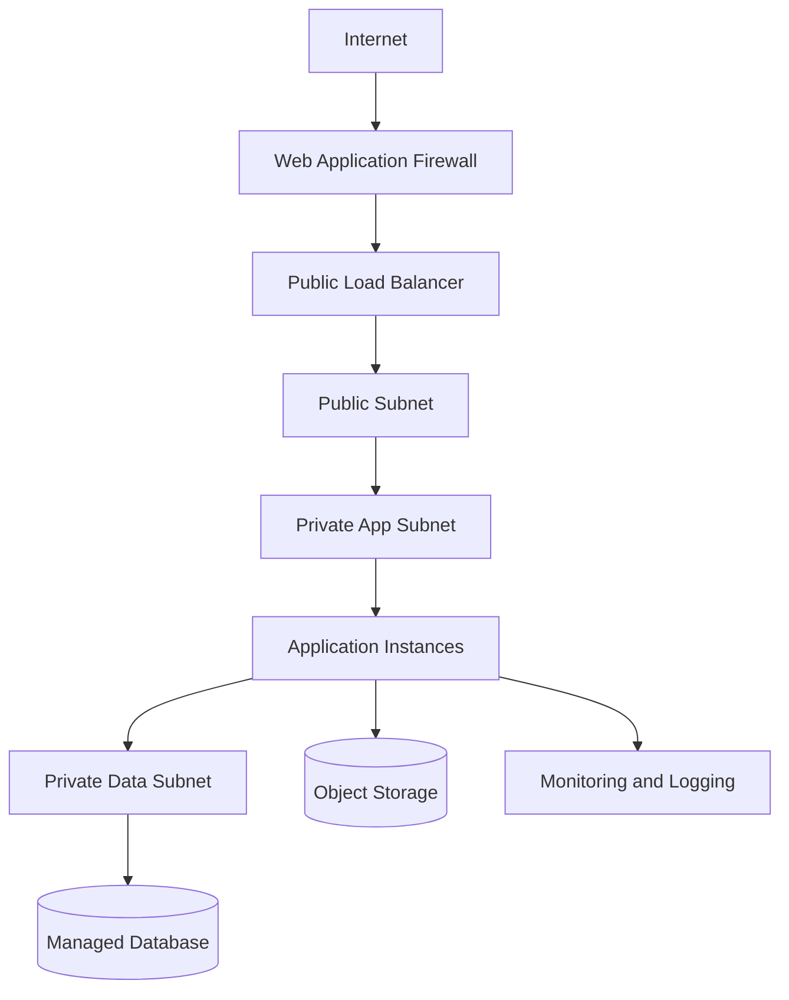
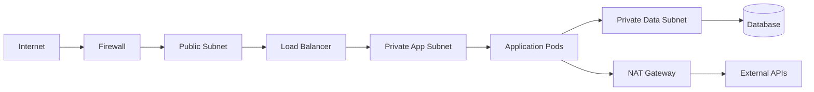
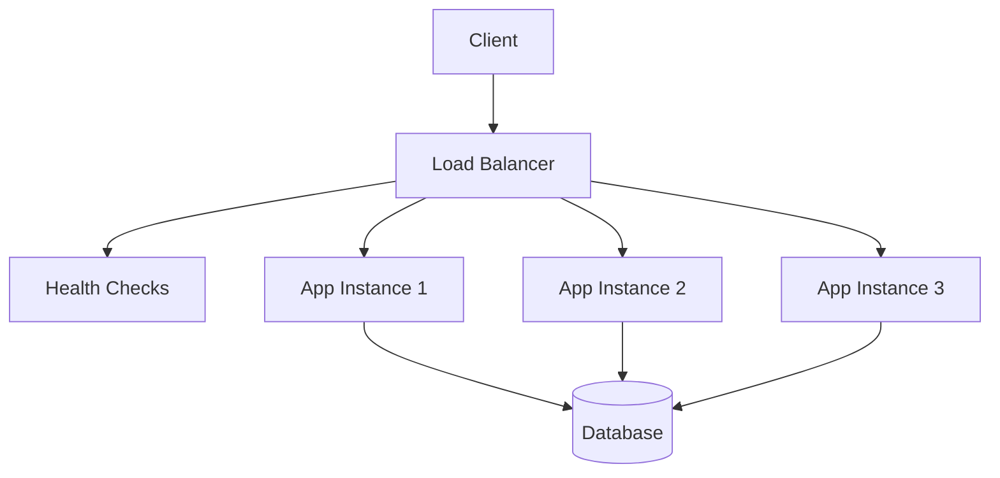
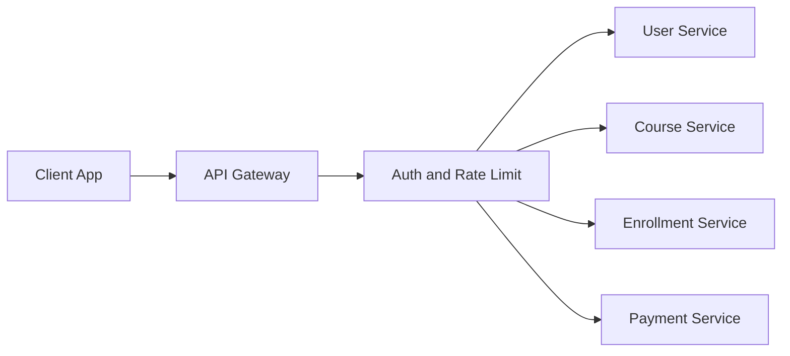
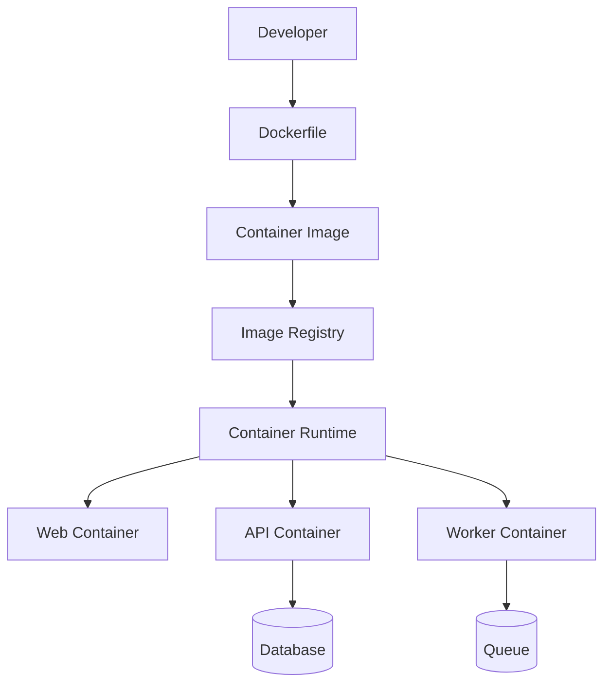
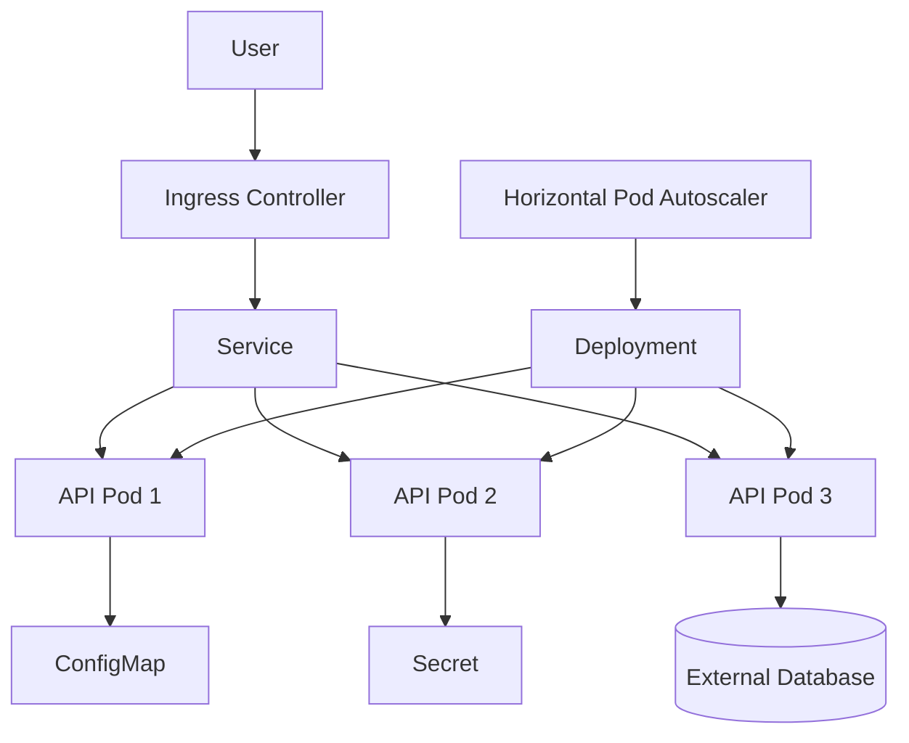

# Deployment, Infrastructure, Network, Docker, Kubernetes, and CI/CD

## Learning Objective
By the end of this lesson, you will design production deployment diagrams, infrastructure diagrams, network diagrams, load balancer flow, API gateway flow, Docker architecture, Kubernetes architecture, and CI/CD pipeline diagrams.

## Why Infrastructure Design Matters
Software design is incomplete until you know how the system runs in production.

Senior developers consider:
- Where the app is deployed
- How traffic enters
- How services communicate
- How data is protected
- How releases happen
- How failures are detected
- How rollback works
- How the system scales

## Deployment Diagram
A deployment diagram shows runtime nodes and where software components run.

## Infrastructure Diagram
An infrastructure diagram shows cloud or physical resources.

## Network Diagram
A network diagram focuses on boundaries, subnets, firewalls, and traffic rules.

## Load Balancer Diagram
A load balancer distributes traffic across healthy instances.

Key design points:
- Health checks
- TLS termination
- Sticky sessions if needed
- Horizontal scaling
- Rate limiting if supported
- Blue-green or canary release support

## API Gateway Diagram
An API gateway is the entry point for APIs.

API gateway responsibilities:
- Routing
- Authentication verification
- Rate limiting
- Request size limits
- API versioning
- Logging
- CORS policy
- Basic request validation

Do not put all business logic in the gateway.

## Docker Architecture Diagram
Docker packages applications and dependencies into containers.

Docker design concerns:
- Small images
- Non-root user
- Environment variables
- Health checks
- Logs to stdout
- No secrets baked into image
- Separate build and runtime stages

## Kubernetes Architecture Diagram
Kubernetes orchestrates containers across a cluster.

Kubernetes concepts:
- Pod: smallest deployable unit
- Deployment: manages pod replicas
- Service: stable network endpoint
- Ingress: HTTP entry routing
- ConfigMap: non-secret config
- Secret: sensitive config
- HPA: autoscaling
- Namespace: isolation boundary
- Readiness probe: can receive traffic
- Liveness probe: should be restarted

## CI/CD Pipeline Diagram
CI/CD automates build, test, security checks, deployment, and rollback.

```mermaid
flowchart LR
    Developer[Developer Push] --> Source[Git Repository]
    Source --> Build[Build]
    Build --> UnitTest[Unit Tests]
    UnitTest --> SecurityScan[Security Scan]
    SecurityScan --> ImageBuild[Build Docker Image]
    ImageBuild --> Registry[Push Image]
    Registry --> DeployStaging[Deploy Staging]
    DeployStaging --> IntegrationTest[Integration Tests]
    IntegrationTest --> Approval[Approval]
    Approval --> DeployProd[Deploy Production]
    DeployProd --> Monitor[Monitor and Rollback]
```

## Environments
Common environments:
- Local
- Development
- Testing
- Staging
- Production

Each environment should define:
- Config
- Secrets
- Database strategy
- Access control
- Logging level
- Deployment approval

## Release Strategies
- Rolling deployment: gradually replace instances.
- Blue-green: switch traffic from old environment to new environment.
- Canary: send small traffic percentage to new version.
- Feature flag: deploy code but control feature visibility.
- Rollback: return to previous stable version.

## Senior-Level Tradeoffs
- Kubernetes is powerful but operationally expensive.
- Docker is useful even without Kubernetes.
- API gateway simplifies entry control but can become a bottleneck.
- Load balancers improve availability but require stateless application design.
- More environments improve safety but increase maintenance.
- CI/CD speed should not remove necessary quality gates.

## Common Mistakes
- Exposing databases to the public network.
- Storing secrets in source code or images.
- No health checks.
- No rollback plan.
- No staging environment.
- No monitoring after deployment.
- Using Kubernetes for a tiny app without operational need.
- Mixing infrastructure and application concerns.

## Infrastructure Checklist
- Traffic entry point is clear.
- Public and private network boundaries are clear.
- Database is private.
- Load balancer health checks exist.
- API gateway rules are documented.
- Containers have health checks and safe config.
- Kubernetes probes are defined if Kubernetes is used.
- CI/CD has test and security gates.
- Rollback process is documented.
- Monitoring and alerts are connected.

## Practice Task
Draw a production deployment for the learning platform.

Include:
- CDN
- Load balancer
- API gateway
- Application containers
- Database
- Cache
- Queue
- Worker
- Monitoring
- CI/CD pipeline

## Interview and Design Review Questions
- What is publicly accessible?
- What is private?
- How does the system scale horizontally?
- What happens during deployment failure?
- Where are secrets stored?
- How does the load balancer know an instance is healthy?
- What is the rollback strategy?
- Why use or avoid Kubernetes?

## Summary
Deployment and infrastructure diagrams explain how design becomes production software. Senior developers connect architecture to real runtime concerns: network, load balancing, gateways, containers, orchestration, CI/CD, monitoring, and rollback.
