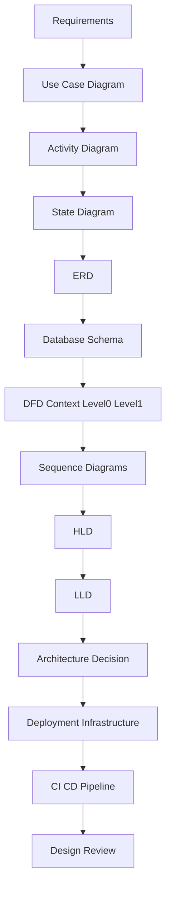
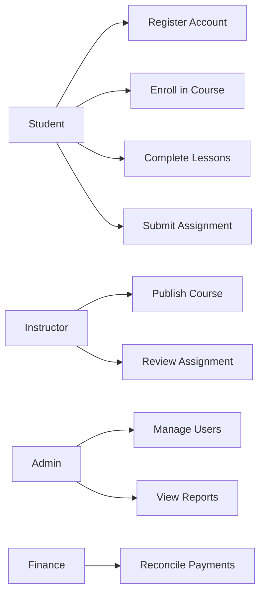
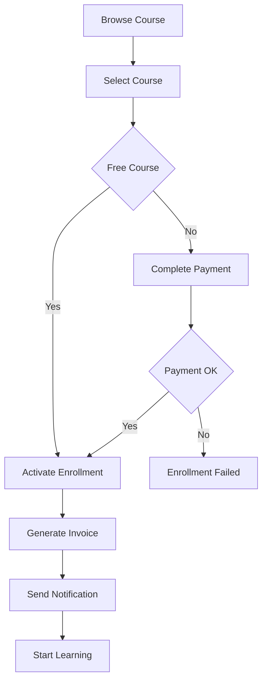
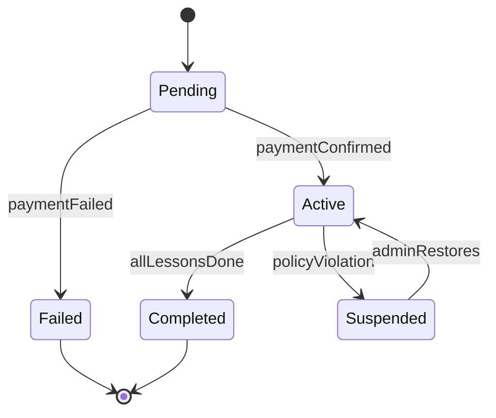
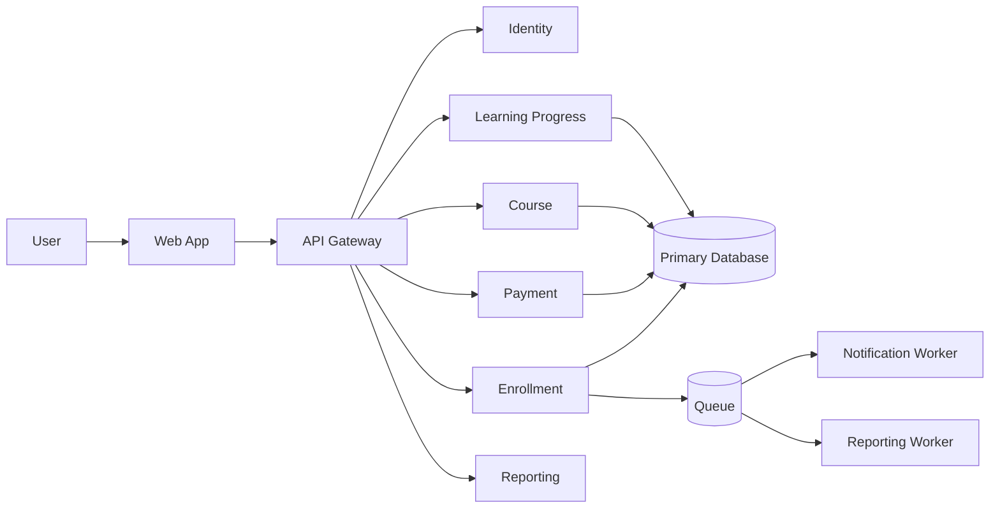
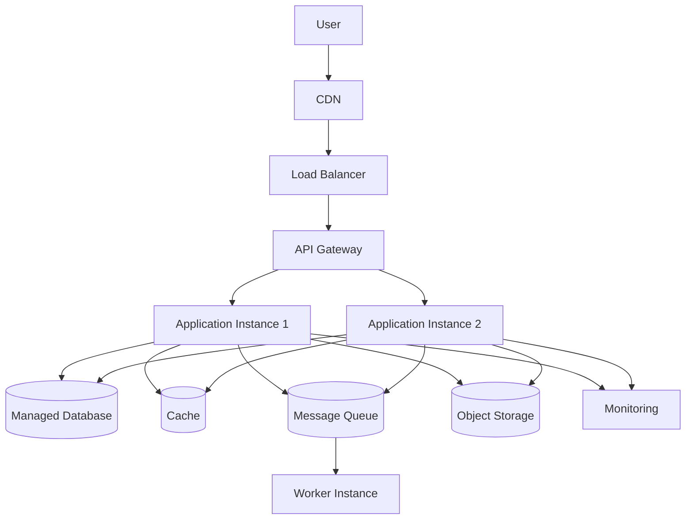

# Capstone: Complete High Level Software Design

## Learning Objective
By the end of this lesson, you will know how to combine analysis, database design, DFD, sequence diagrams, HLD, LLD, architecture, and deployment diagrams into one complete senior-level software design document.

## Capstone Scenario
Design a Learning Management and ERP Platform for an organization.

The platform must support:
- Student registration and login
- Course browsing
- Paid and free enrollment
- Lesson progress tracking
- Assignment submission
- Instructor review
- Invoice and payment records
- Admin reporting
- Email notifications
- Production deployment

## Final Design Document Structure
Use this structure for a professional design document:

1. Executive summary
2. Problem statement
3. Goals and non-goals
4. Assumptions and constraints
5. Actors and use cases
6. Activity diagrams
7. State diagrams
8. ERD and database schema
9. Normalization notes
10. DFD Context, Level 0, Level 1
11. Sequence diagrams
12. HLD
13. LLD for critical modules
14. Architecture style decision
15. Deployment and infrastructure diagrams
16. Security design
17. Scalability design
18. Reliability design
19. Observability design
20. CI/CD design
21. Risks and tradeoffs
22. Review checklist

## End-to-End Design Flow

## Step 1: Problem Statement
Example:

The organization needs a platform where students can enroll in courses, instructors can manage learning content, finance teams can track payments, and administrators can report on learning progress and revenue.

## Step 2: Goals
- Support course enrollment.
- Support paid and free courses.
- Track lesson progress.
- Support assignment submission and review.
- Generate invoice and payment records.
- Send notifications.
- Provide reports.

## Step 3: Non-Goals
- Live video streaming.
- Complex tax calculation.
- Multi-region disaster recovery in version one.
- AI recommendations.

## Step 4: Actors and Use Cases

## Step 5: Main Workflow

## Step 6: State Diagram

## Step 7: Data Model
Core entities:
- User
- Role
- Course
- Lesson
- Enrollment
- Progress
- Assignment
- Submission
- Invoice
- Payment
- Notification
- AuditLog

Important relationships:
- User has many enrollments.
- Course has many lessons.
- Course has many enrollments.
- Enrollment has progress records.
- Enrollment can generate invoices.
- Invoice has payment attempts.
- Assignment has submissions.

## Step 8: DFD Summary
Context:
- Students, instructors, admins, finance, payment gateway, and email service exchange data with the platform.

Level 0:
- Manage account
- Manage course
- Manage enrollment
- Process payment
- Track learning
- Review assignment
- Generate reports

Level 1:
- Expand enrollment and payment because they are high-risk flows.

## Step 9: Sequence Summary
Critical sequence diagrams:
- Login
- Paid enrollment
- Assignment submission
- Instructor review
- Report generation
- Payment webhook processing

## Step 10: HLD Summary

## Step 11: LLD Candidates
Create LLD for the riskiest modules:
- Enrollment creation
- Payment confirmation
- Assignment submission
- Report export
- Permission checking

For each LLD include:
- Class/module diagram
- Method responsibilities
- Validation
- Transactions
- Errors
- Tests

## Step 12: Architecture Decision
Recommended first version: modular monolith.

Reason:
- One deployment is simpler.
- Module boundaries can still be strict.
- Transactions are easier.
- Team can move faster.
- Future extraction to microservices remains possible.

Future extraction candidates:
- Payment service
- Notification service
- Reporting service
- Media processing service

## Step 13: Deployment Design

## Step 14: CI/CD Design
Pipeline:
1. Developer pushes code.
2. CI runs lint and unit tests.
3. Security scan runs.
4. Docker image is built.
5. Image is pushed to registry.
6. Staging deployment runs.
7. Integration tests run.
8. Production approval is requested.
9. Production deployment starts.
10. Monitoring verifies release health.
11. Rollback runs if health checks fail.

## Senior Review Checklist
- Does the design solve the stated problem?
- Are goals and non-goals clear?
- Are actors and use cases complete?
- Are workflows and states documented?
- Is the data model normalized correctly?
- Are relationships and constraints clear?
- Are DFDs balanced?
- Are sequence diagrams showing failures?
- Does HLD show responsibilities and ownership?
- Does LLD explain implementation risk?
- Is the architecture style justified?
- Are deployment and network boundaries secure?
- Is CI/CD realistic?
- Are security, reliability, scale, and observability covered?
- Are tradeoffs and risks honest?

## Portfolio Task
Create a full design document for one system:
- Hospital management
- E-commerce marketplace
- Inventory and warehouse
- Payroll and HR
- Learning platform
- Restaurant ordering

Required deliverables:
- Use case diagram
- Activity diagram
- State diagram
- ERD
- Database schema
- Relationship diagram
- Normalization notes
- DFD Context
- DFD Level 0
- DFD Level 1
- Sequence diagram
- HLD
- LLD
- Architecture diagram
- Deployment diagram
- Network diagram
- Load balancer diagram
- API gateway diagram
- Docker architecture diagram
- Kubernetes architecture diagram
- CI/CD pipeline diagram

## Interview and Design Review Questions
- Why did you choose this architecture first?
- Which module owns each table?
- Which workflows are asynchronous?
- Which failures are most dangerous?
- Which database constraints protect business rules?
- Which part should scale first?
- What is your rollback plan?
- How would this design change for 10x users?

## Summary
A senior software design is a connected story. Requirements lead to diagrams, diagrams lead to design decisions, and design decisions lead to implementation and production operation. The best portfolio proves that you can think from business need to running system.
