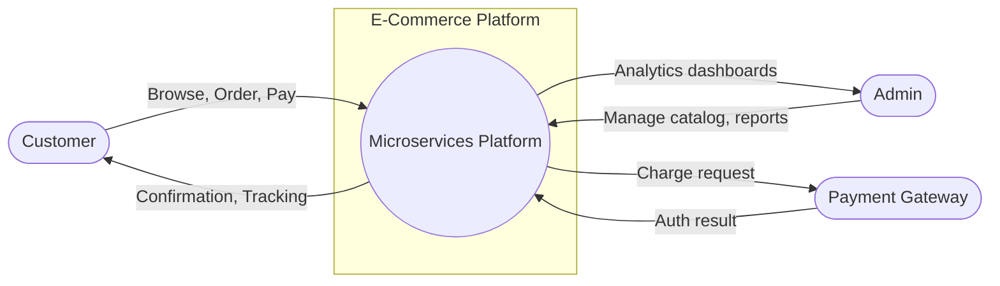
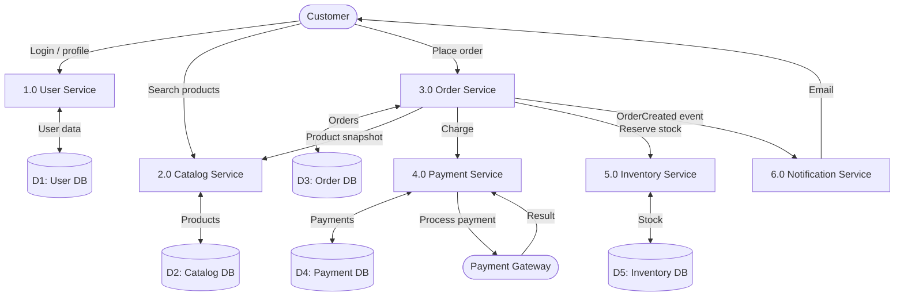
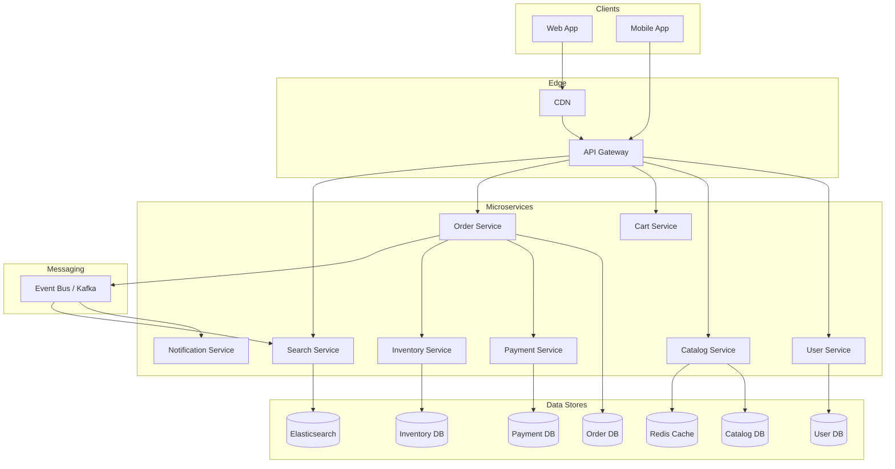
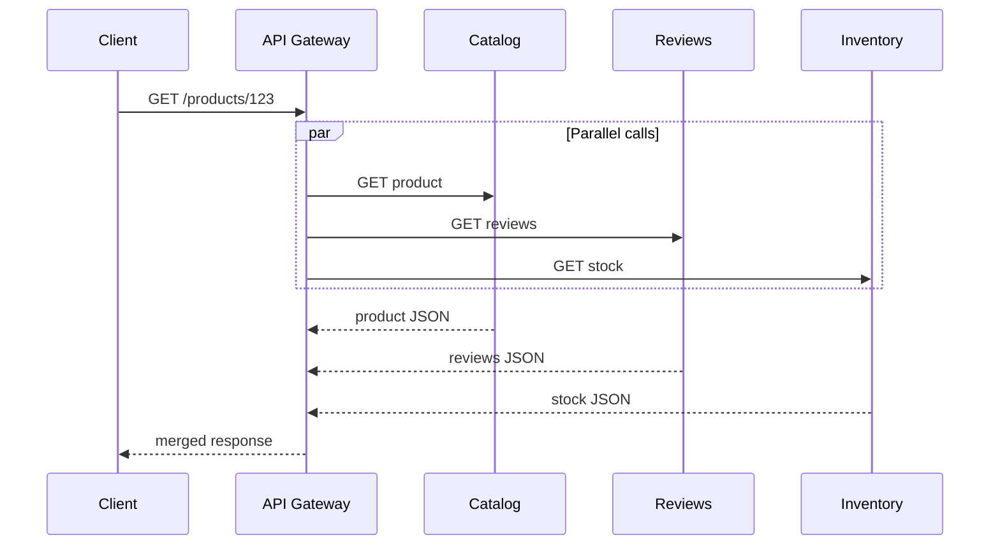
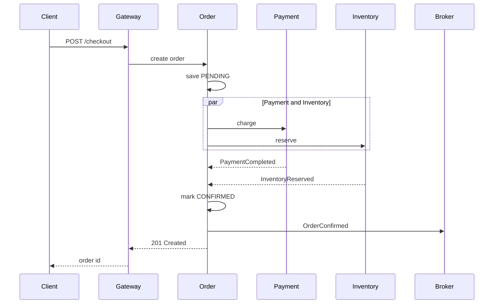
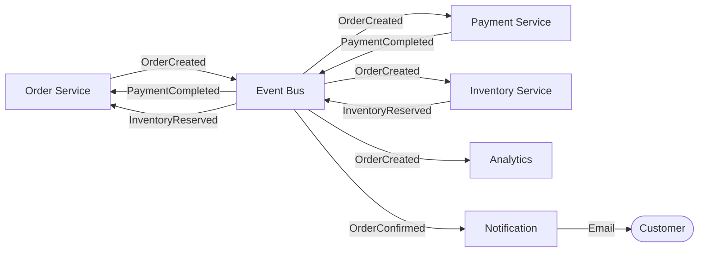
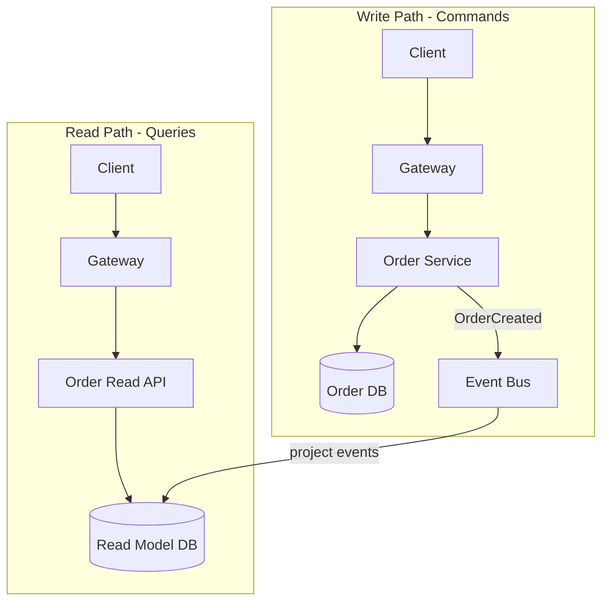
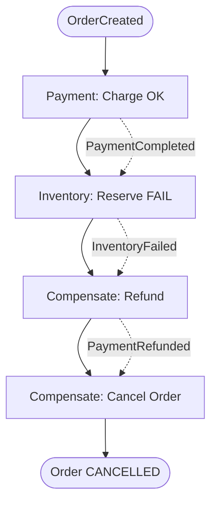
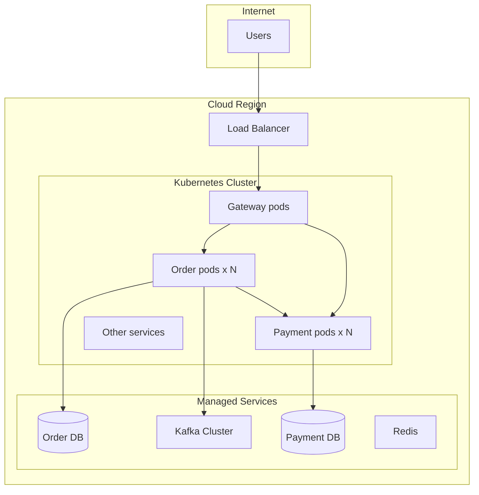
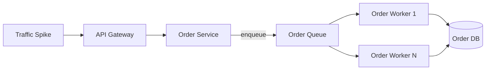

# Data Flow Diagrams & System Design (Microservices)

> **Reference guide** — read after Module 04, before or with Modules 05–10  
> **Related:** [05 Communication](./part-02-core-architecture/05-communication-patterns.md) · [06 Data Management](./part-02-core-architecture/06-data-management.md) · [21 Capstone](./part-04-advanced/21-capstone-architecture-projects.md)

## Learning outcomes

After this guide you can:

1. Draw context and Level 1 data flow diagrams for a microservices system
2. Produce a system design with services, databases, and message flows
3. Distinguish sync request flow vs async event flow
4. Document read path, write path, and checkout saga flow

---

## Part 1 — Data Flow Diagram (DFD) basics

A **Data Flow Diagram** shows how **data moves** between external entities, processes, and data stores. It answers: *who sends what to whom?*

### DFD levels

| Level | Shows | Microservices equivalent |
|-------|-------|--------------------------|
| **Context (0)** | Whole system + external actors | Platform boundary + users/partners |
| **Level 1** | Major processes inside system | Services or bounded contexts |
| **Level 2+** | Detail inside one process | Internal service logic (optional) |

### Symbols

| Symbol | Name | Microservices example |
|--------|------|------------------------|
| Rectangle / actor | External entity | Customer, Admin, Payment Gateway |
| Circle / process | Process | Order Service, Payment Service |
| Open box / cylinder | Data store | Order DB, Catalog DB |
| Arrow | Data flow | OrderRequest, PaymentCompleted event |

**Note:** In microservices, each **data store** belongs to **one service** only. No shared database arrows between services.

---

## Part 2 — Context diagram (Level 0)

E-commerce platform as one system boundary:



---

## Part 3 — Level 1 DFD (microservices processes)

Each process maps to a **service**. Data stores are **per service**.



### Data flow labels (checkout)

| Flow | From → To | Data |
|------|-----------|------|
| F1 | Customer → Order | OrderRequest (items, address) |
| F2 | Order → Catalog | ProductIds (read snapshot) |
| F3 | Order → Payment | ChargeRequest (amount, idempotency key) |
| F4 | Payment → Gateway | Card token / payment intent |
| F5 | Order → Inventory | ReserveRequest (sku, qty) |
| F6 | Order → Broker → Notification | OrderCreated event |

---

## Part 4 — System design architecture

### 4.1 High-level system design (containers)



### 4.2 Layer responsibilities

| Layer | Components | Responsibility |
|-------|------------|----------------|
| Client | Web, Mobile | UI, user interaction |
| Edge | CDN, API Gateway | TLS, auth, rate limit, routing |
| Services | User, Order, Payment… | Business logic, own data |
| Messaging | Kafka/RabbitMQ | Async events, decoupling |
| Data | DB per service, cache, search | Persistence, read optimization |

---

## Part 5 — Request data flow (synchronous)

### 5.1 Product detail page (parallel fan-out)



**Time complexity:** O(1) wall-clock ≈ slowest branch (Module 10).

### 5.2 Checkout (sequential + parallel)



---

## Part 6 — Event data flow (asynchronous)

### 6.1 Choreographed checkout events



### 6.2 Event-carried state transfer

```
OrderCreated {
  orderId: "ORD-123",
  customerId: "USR-456",
  items: [{ sku, name, price, qty }],
  total: 99.99
}
```

Notification Service acts **without** calling Order Service again.

---

## Part 7 — Read path vs write path (CQRS-style)



| Path | Optimized for | Consistency |
|------|---------------|-------------|
| Write | Validations, transactions | Strong within service |
| Read | Fast lists, dashboards | Eventual (ms–seconds lag) |

---

## Part 8 — Saga failure data flow

When inventory fails after payment succeeds:



---

## Part 9 — Deployment system design



---

## Part 10 — Scalability data flow (peak traffic)

Black Friday — queue absorbs write spike:



---

## Part 11 — Document your system design

For every project, maintain:

| Artifact | Purpose |
|----------|---------|
| Context DFD | Scope and external actors |
| Level 1 DFD | Services and data stores |
| System design diagram | Containers, gateway, broker, DBs |
| Sequence diagram | Critical sync flows (checkout, login) |
| Event flow diagram | Async choreography |
| Deployment diagram | K8s, regions, load balancers |
| Latency budget table | Per-hop ms allocation (Module 09) |

Template checklist for capstone: [21-capstone-architecture-projects.md](./part-04-advanced/21-capstone-architecture-projects.md)

---

## Part 12 — Common mistakes

| Mistake | Fix |
|---------|-----|
| Shared DB on DFD between services | One data store per service; use API/events |
| DFD shows HTTP methods | DFD shows **data**, not REST verbs |
| No event flows on diagram | Add broker + subscribers for async paths |
| One diagram for everything | Separate context, system design, sequence, event flow |

---

## Practice exercises

1. Draw a **context DFD** for a food delivery app (Customer, Restaurant, Driver, Payment).
2. Draw **Level 1 DFD** with at least 5 services and 5 data stores.
3. Draw **sequence diagram** for login → browse → checkout.
4. Label which flows are **sync** vs **async**.
5. Add **failure saga** path for payment success + inventory fail.

Solutions approach: [exercises/module-05.md](../exercises/module-05.md) · Capstone: [module-21.md](../exercises/module-21.md)

---

## Next reading

- [05 — Communication Patterns](./part-02-core-architecture/05-communication-patterns.md)
- [08 — Scalability Patterns](./part-02-core-architecture/08-scalability-patterns.md)
- [21 — Capstone Architecture Projects](./part-04-advanced/21-capstone-architecture-projects.md)
