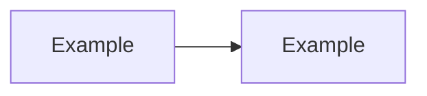

# Module Documentation Template

Copy this structure when authoring or expanding a module.

---

# NN — Module Title

> **Part:** I Foundations | II Core Architecture | III Production | IV Advanced  
> **Week:** N | **Exercises:** [exercises/module-NN.md](../exercises/module-NN.md)

## Learning outcomes

After this module you can:

1. …
2. …
3. …

## Concepts

### Subtopic 1

Explanation with diagram if helpful.

### Subtopic 2

…

## Performance / scalability / complexity notes

| Aspect | Detail |
|--------|--------|
| Latency impact | … |
| Scalability | … |
| Time complexity | … |

## Common mistakes

| Mistake | Fix |
|---------|-----|
| … | … |

## Exercises

See [exercises/module-NN.md](../exercises/module-NN.md). Solutions: [exercises/solutions/module-NN.md](../exercises/solutions/module-NN.md).

## Further reading

- Book or article reference

## Next module

Link to next doc.

---

## Author checklist

- [ ] Learning outcomes are measurable
- [ ] At least one mermaid diagram
- [ ] 3+ exercises with solutions
- [ ] Performance/scalability note where relevant
- [ ] Cross-links to related modules and appendices
