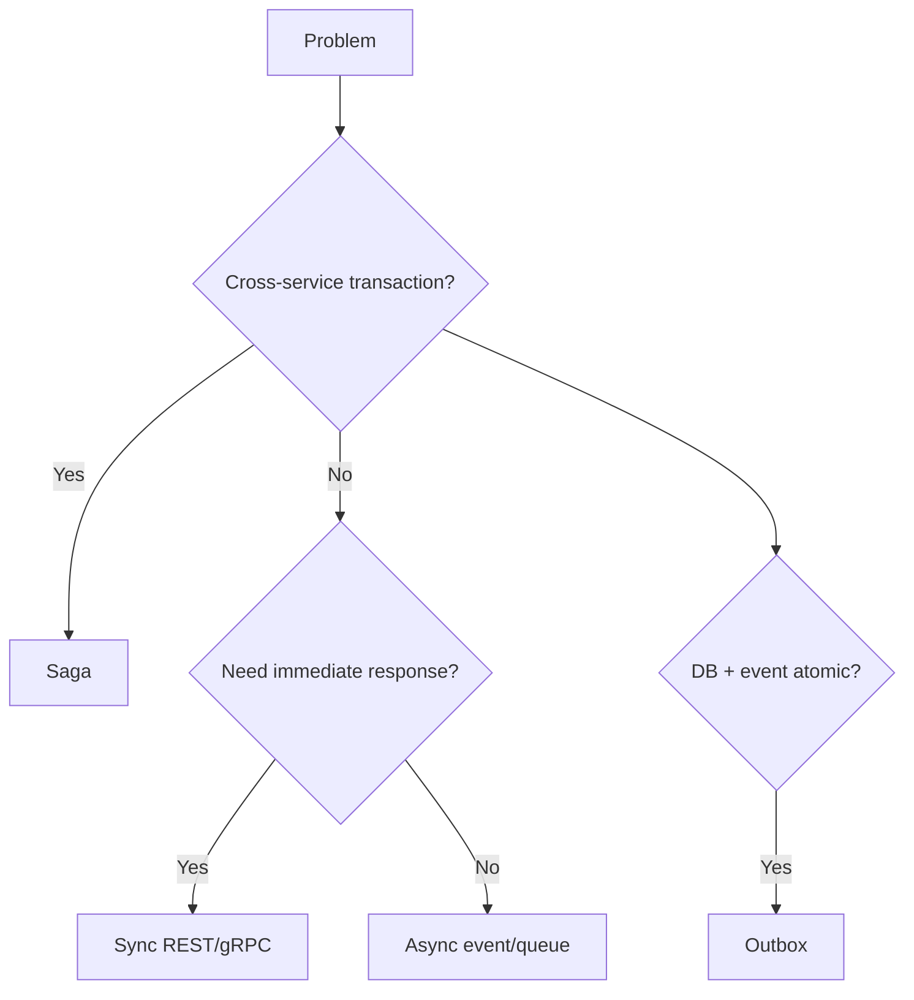

# Appendix B — Pattern Catalog

One-page reference for microservices patterns.

| Pattern | Problem | Solution | Trade-off |
|---------|---------|----------|-----------|
| **Context / Level 1 DFD** | Unclear data movement | Draw actors, services, DBs, flows | See [E-data-flow](../DATA-FLOW-AND-SYSTEM-DESIGN.md) |
| **Database per service** | Shared schema coupling | Each service owns DB | No cross-DB joins |
| **API Gateway** | Many client entry points | Single edge router | Extra hop |
| **BFF** | Different client needs | Backend per frontend | More components |
| **Saga** | No distributed ACID | Local txs + compensation | Complex failure paths |
| **Outbox** | Dual write DB + event | Outbox table + relay | Relay lag |
| **CQRS** | Read/write conflict | Separate models | Sync lag |
| **Event sourcing** | Audit + temporal queries | Event log as truth | Replay O(n) |
| **Circuit breaker** | Cascading failure | Fail fast when down | False positives |
| **Bulkhead** | Resource exhaustion | Isolated pools | Lower utilization |
| **Cache-aside** | DB overload | Redis/CDN cache | Stale data |
| **Read replica** | Read scale | Copy for reads | Replication lag |
| **Sharding** | Write scale limit | Partition by key | Cross-shard queries hard |
| **Strangler Fig** | Big-bang rewrite risk | Incremental extract | Long migration |
| **Anti-corruption layer** | Legacy model leak | Translate at boundary | Mapping code |
| **Sidecar** | Cross-cutting in app | Helper container | Sidecar overhead |
| **Service mesh** | Repeated mTLS/retries | Proxy per pod | Ops complexity |
| **Consumer contract test** | Breaking API changes | Pact verification | Test maintenance |
| **Idempotency key** | Duplicate writes | Dedup by key | Storage for keys |
| **Event notification** | Minimal events | ID + type only | Callback needed |
| **Event-carried state** | Callback overhead | Full payload in event | Duplication |
| **Orchestration** | Complex workflow | Central coordinator | Coupling |
| **Choreography** | Loose coupling | Event reactions | Hard to trace |
| **Blue-green deploy** | Safe rollback | Two environments | 2× infra briefly |
| **Canary deploy** | Limit bad deploy blast | Gradual traffic shift | Traffic routing needed |
| **HPA** | Variable load | Auto scale pods | Cooldown tuning |
| **Backpressure** | Overload cascade | Slow/reject upstream | User errors |
| **Graceful degradation** | Total outage | Partial experience | Reduced UX |
| **Zero trust** | Insider threat | Verify all calls | mTLS overhead |

---

## Pattern selection flow

See module docs for full detail.
