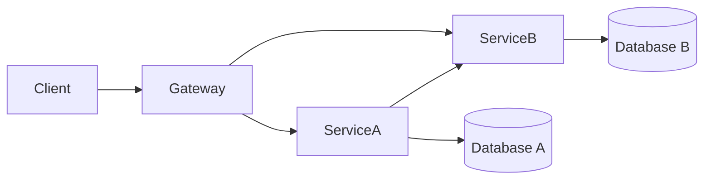

# 00 — Distributed Systems Basics

> **Part:** I Foundations | **Week:** 1 | **Exercises:** [module-00](../../exercises/module-00.md)

## Learning outcomes

After this module you can:

1. Distinguish a monolithic process from a distributed system
2. Explain latency, throughput, and partial failure in network-based systems
3. List the fallacies of distributed computing and their practical impact
4. Describe why microservices inherit distributed-system constraints

---

## What is a distributed system?

A **distributed system** is a collection of independent computers that appear to the user as a single coherent system, coordinated via messages over a network.

Microservices are distributed systems by definition — each service is a separate process, often on separate machines.

Unlike a monolith (in-process function calls), every arrow above crosses a network boundary with real failure modes.

---

## Monolith vs distributed (at a glance)

| Aspect | Monolith | Distributed (microservices) |
|--------|----------|------------------------------|
| Communication | Function call (ns) | Network (ms) |
| Failure | Binary (up/down) | Partial (some services down) |
| Transactions | Single DB ACID | Cross-service eventual consistency |
| Debugging | Single stack trace | Trace across many services |

---

## Latency and throughput

| Term | Definition | User impact |
|------|------------|-------------|
| **Latency** | Time for one operation to complete | "How long until I see my order?" |
| **Throughput** | Operations completed per second (QPS/TPS) | "Can the system handle Black Friday?" |

They are related but not identical. Batching can raise throughput while increasing per-request latency.

**Performance** = how fast one request completes.  
**Scalability** = how well the system handles growth by adding resources.

---

## Partial failure

In a monolith, if the app crashes, everything stops. In microservices:

- Payment Service may be down while Catalog still works
- A slow Inventory Service may block checkout if called synchronously
- One bad deploy affects one service — unless cascading failure spreads

Design assumption: **failure is normal**, not exceptional.

---

## The fallacies of distributed computing

Peter Deutsch and others identified assumptions that are **false** in distributed systems:

| Fallacy | Reality |
|---------|---------|
| The network is reliable | Packets drop; connections reset |
| Latency is zero | Every hop adds milliseconds |
| Bandwidth is infinite | Large payloads saturate links |
| The network is secure | Internal traffic can be attacked |
| Topology doesn't change | Services move, IPs change |
| There is one administrator | Many teams own many services |
| Transport cost is zero | Serialization + TLS cost CPU |
| The network is homogeneous | Different clouds, regions, protocols |

Microservices architecture must account for every row.

---

## CAP theorem (preview)

In a partition (network split), you cannot have both perfect **C**onsistency and **A**vailability. Since partitions happen, you choose **CP** or **AP**. Most microservices choose **AP + eventual consistency** (detailed in Module 06).

---

## Time and complexity preview

| Pattern | Latency behavior |
|---------|------------------|
| 1 network hop | ~1–50ms typical (depends on distance) |
| k sequential hops | Latencies **add** → O(k) |
| k parallel calls | Wall-clock ≈ slowest branch |

Module 10 covers full complexity analysis.

---

## Common mistakes

| Mistake | Fix |
|---------|-----|
| Treating remote calls like local calls | Add timeouts, retries, fallbacks |
| Ignoring partial failure in design | Design degraded modes per service |
| Assuming "internal network is safe" | Zero trust, mTLS (Module 11) |

---

## Exercises

See [exercises/module-00.md](../../exercises/module-00.md). Solutions: [exercises/solutions/module-00.md](../../exercises/solutions/module-00.md).

## Further reading

- *Designing Data-Intensive Applications* — Ch. 1–2 (Martin Kleppmann)

## Next module

[01 — Introduction to Microservices →](./01-introduction.md)
