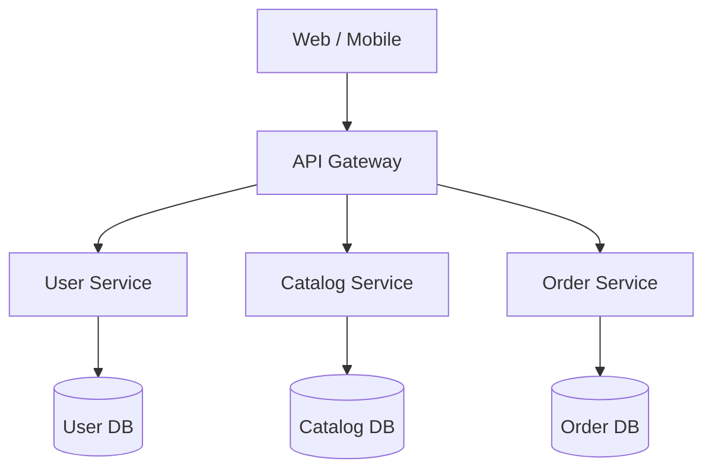

# 01 — Introduction to Microservices

> **Part:** I Foundations | **Week:** 1 | **Exercises:** [module-01](../../exercises/module-01.md)

## Learning outcomes

After this module you can:

1. Define microservices and list six core characteristics
2. Explain the historical shift from monoliths to microservices
3. Draw a basic multi-service architecture with API Gateway
4. Correct common misconceptions about microservices

---

## What is a microservice?

A **microservice** is a small, independently deployable software component that implements a single **business capability**. It runs as its own process, communicates over a network, and owns its own data.

Microservices are an **architectural style**, not a technology. You can implement them in Java, Go, Node.js, Python, or .NET.

---

## Core characteristics

| Characteristic | Meaning |
|----------------|---------|
| Single responsibility | One business job (billing, inventory, notifications) |
| Independent deployment | Release one service without redeploying others |
| Decentralized data | Each service owns its database |
| Loose coupling | Interact via APIs/events, not shared DB or code |
| Business capability alignment | Boundaries follow domain, not UI/logic/data layers |
| Failure isolation | Crash in one service should not kill all |

---

## Example: online bookstore

For **full system design** and **data flow diagrams** (context DFD, checkout sequence, event flows), see [DATA-FLOW-AND-SYSTEM-DESIGN.md](../DATA-FLOW-AND-SYSTEM-DESIGN.md).

---

## Key vocabulary

| Term | Definition |
|------|------------|
| Service | Independently running component with defined interface |
| API | Contract exposing capabilities |
| Bounded context | Domain boundary where a model applies (DDD) |
| Orchestration | Central coordinator calls services in sequence |
| Choreography | Services react to events without central boss |
| Eventual consistency | Data converges over time, not instantly |
| Service discovery | Dynamic lookup of service locations |

---

## What microservices are NOT

| Misconception | Reality |
|---------------|---------|
| "Micro = tiny code" | Size doesn't matter; clarity of boundary does |
| "Microservices = REST" | REST/gRPC/events are implementation details |
| "Always better performance" | More hops add latency; benefit is scale and autonomy |
| "Eliminates complexity" | Moves complexity to network, data, operations |
| "Default for every project" | Most MVPs should start as monolith or modular monolith |

---

## Performance / scalability / flexibility notes

| Dimension | Microservices impact |
|-----------|---------------------|
| **Scalability** | Scale Order Service 10× without scaling Admin |
| **Flexibility** | Teams deploy independently; polyglot stacks |
| **Performance** | Often **worse** per-request latency (network hops) unless optimized |

---

## Common mistakes

| Mistake | Fix |
|---------|-----|
| Adopting microservices on day one | Start modular monolith (Module 02) |
| Splitting by technical layer | Split by business capability (Module 03) |

---

## Exercises

See [exercises/module-01.md](../../exercises/module-01.md).

## Next module

[02 — Monolith vs Microservices →](./02-monolith-vs-microservices.md)
