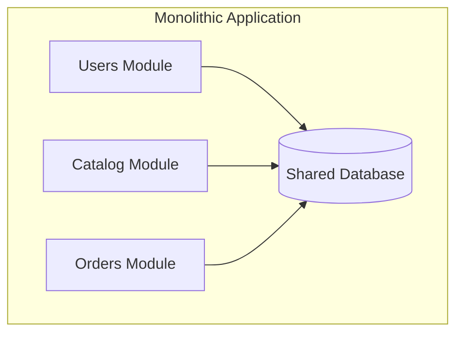

# 02 — Monolith vs Microservices

> **Part:** I Foundations | **Week:** 2 | **Exercises:** [module-02](../../exercises/module-02.md)

## Learning outcomes

After this module you can:

1. Compare monolith and microservices across deployment, scaling, data, and teams
2. Explain the modular monolith as a pragmatic middle ground
3. Identify valid migration triggers and anti-triggers
4. Argue when microservices hurt performance and flexibility

---

## What is a monolith?

One deployable application: all features in one codebase, one artifact, often one database.

---

## Side-by-side comparison

| Dimension | Monolith | Microservices |
|-----------|----------|---------------|
| Deployment | All together | Per service |
| Scaling | Whole app | Per service |
| Technology | Usually one stack | Polyglot possible |
| Data | Shared DB, ACID | DB per service, eventual consistency |
| Time complexity (request path) | O(1) in-process | O(k) for k network hops |
| Best for | MVP, small teams | Large systems, many teams |

---

## Strengths and weaknesses

### Monolith strengths
- Simplicity, ACID transactions, fast in-process calls, easy debugging, lower ops cost

### Monolith weaknesses
- Deployment bottleneck, scale-all-or-nothing, team conflicts, large blast radius

### Microservices strengths
- Independent deploy, targeted scaling, fault isolation, team autonomy, technology freedom

### Microservices weaknesses
- Distributed complexity, eventual consistency, ops overhead, harder testing/debugging

---

## Modular monolith (recommended start)

- One deployable unit
- Internal modules with clear boundaries
- Each module owns its tables
- Extract to microservices when boundaries are proven

---

## When to choose each

**Monolith:** MVP, &lt;8–10 developers, unclear domain, speed to market.

**Microservices:** Multiple teams blocked by deploys, different scaling needs per module, stable bounded contexts, compliance isolation (PCI).

**Do NOT split yet:** No observability, boundaries change every sprint, "because it's modern."

---

## Migration triggers

| Signal | Meaning |
|--------|---------|
| Deploy takes hours, blocks teams | Release bottleneck |
| One module needs 10× resources | Scaling mismatch |
| Bug in one area crashes all | Need failure isolation |
| PCI/regulatory isolation | Compliance driver |

Use **Strangler Fig** — incremental extraction (Module 14, 16).

---

## Performance note

Monoliths win **raw request latency** (no network between modules). Microservices win **organizational and independent scaling**. Do not expect microservices to be faster per request by default.

---

## Exercises

See [exercises/module-02.md](../../exercises/module-02.md).

## Next module

[03 — Core Principles & DDD →](./03-core-principles.md)
