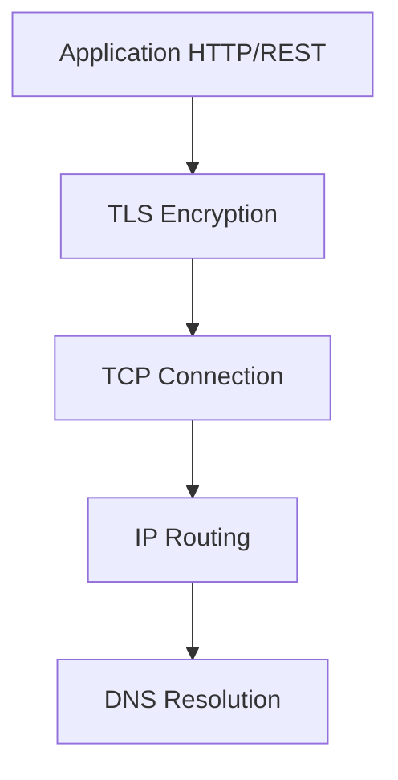

# 04 — API & Networking Fundamentals

> **Part:** I Foundations | **Week:** 3–4 | **Exercises:** [module-04](../../exercises/module-04.md)

## Learning outcomes

After this module you can:

1. Explain HTTP request/response lifecycle and common status codes
2. Describe REST resource design and idempotency rules
3. Outline DNS, TCP, and TLS roles in service communication
4. Identify networking costs that affect performance

---

## HTTP basics

Every microservice API call (REST) uses HTTP:

```
Client  ──GET /orders/123──►  Server
Client  ◄──200 OK + JSON────  Server
```

### Methods

| Method | Purpose | Idempotent? |
|--------|---------|-------------|
| GET | Read | Yes |
| POST | Create | No* |
| PUT | Replace | Yes |
| PATCH | Partial update | Often |
| DELETE | Remove | Yes |

*Use Idempotency-Key header for safe POST retries.

### Status codes

| Code | Meaning |
|------|---------|
| 200 | Success |
| 201 | Created |
| 400 | Bad request (client error) |
| 401 | Unauthorized |
| 403 | Forbidden |
| 404 | Not found |
| 409 | Conflict |
| 500 | Server error |
| 503 | Service unavailable |

---

## REST resource design

| Good | Bad |
|------|-----|
| `GET /orders/123` | `GET /getOrder?id=123` |
| `POST /orders` | `POST /createOrder` |
| Nouns for resources | Verbs in URL |

Use plural nouns, proper HTTP methods, JSON payloads.

---

## Network stack (simplified)



| Layer | Role | Performance impact |
|-------|------|-------------------|
| DNS | Resolve hostname to IP | Cache TTL reduces lookup |
| TCP | Reliable connection | Handshake ~1 RTT |
| TLS | Encryption | Handshake ~1–2 RTT; reuse sessions |
| HTTP/1.1 | Request/response | One request per connection (without keep-alive) |
| HTTP/2 | Multiplexing | Multiple streams, one connection |

**Connection pooling** avoids repeated TCP+TLS setup — critical for performance (Module 09).

---

## Latency components of one API call

```
Total = DNS + TCP + TLS + Request serialize + Network RTT + Server process + Response deserialize
```

Typical same-region RTT: 0.5–2ms. Cross-region: 50–150ms+.

---

## Idempotency

Operation safe to repeat: `PUT /orders/123/status` with same body → same result.

Required for retries and at-least-once messaging (Module 05, 07).

---

## Common mistakes

| Mistake | Fix |
|---------|-----|
| New TCP connection per request | Connection pooling |
| Verbose REST URLs | Resource-oriented design |
| Non-idempotent POST without key | Idempotency-Key header |

---

## Exercises

See [exercises/module-04.md](../../exercises/module-04.md).

## Next module

[05 — Communication Patterns →](../part-02-core-architecture/05-communication-patterns.md)
