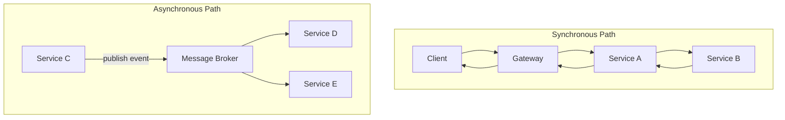
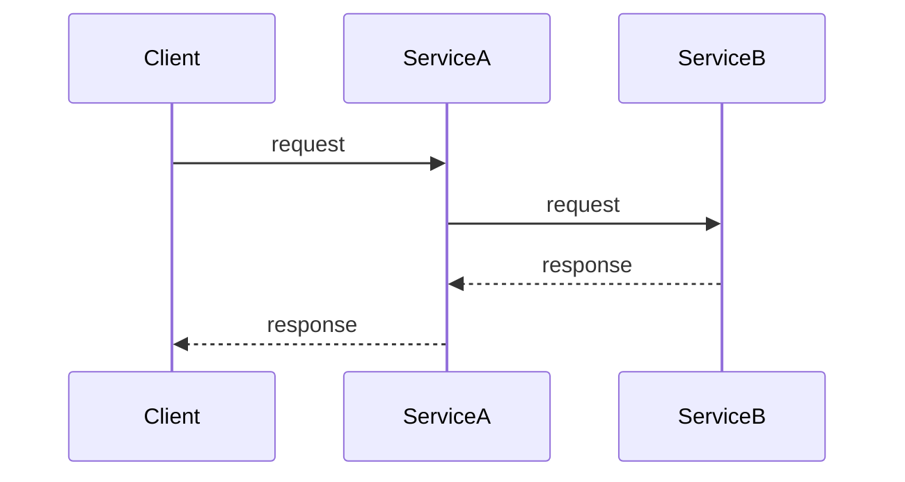
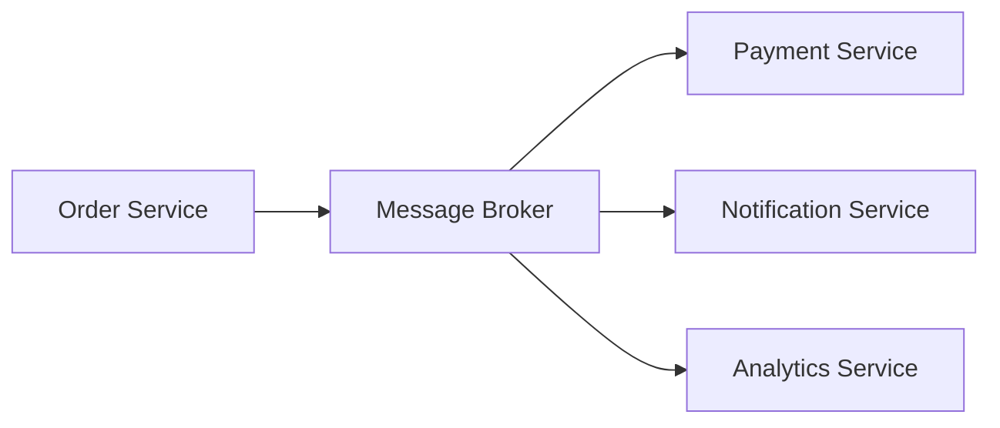

# 05 — Communication Patterns

> **Part:** II Core Architecture | **Week:** 4 | **Exercises:** [module-05](../../exercises/module-05.md)

## Learning outcomes

After this module you can:

1. Choose synchronous vs asynchronous communication for a scenario
2. Compare REST, gRPC, and messaging trade-offs for latency and throughput
3. Design event-driven flows with orchestration or choreography
4. Apply API versioning and idempotency rules

---

## Why communication design matters

Monolith: function calls (nanoseconds). Microservices: network (milliseconds). Pattern choice affects **coupling**, **consistency**, **latency**, and **scalability**.

**Full data flow & system design guide:** [DATA-FLOW-AND-SYSTEM-DESIGN.md](../DATA-FLOW-AND-SYSTEM-DESIGN.md) — context DFD, Level 1 DFD, sequence diagrams, event flows.

---

## Communication data flow overview

| Path | Data moves as | Caller waits? |
|------|---------------|---------------|
| Sync | HTTP/gRPC request/response | Yes |
| Async | Message/event on broker | No |

---

## Synchronous communication

Caller waits for response.

### REST vs gRPC (performance)

| Aspect | REST (JSON/HTTP) | gRPC (Protobuf/HTTP2) |
|--------|------------------|----------------------|
| Payload size | Larger (text) | Smaller (binary) |
| Typing | Loose (OpenAPI) | Strict (.proto) |
| Browser support | Native | Needs grpc-web |
| Latency | Higher serialize cost | Lower |
| Throughput | Good | Often better |
| Best for | Public APIs, simplicity | Internal service-to-service |

### Sync risks

- **Cascading failure** — slow B blocks A blocks Client
- **Latency accumulation** — k hops ≈ O(k) added latency
- **Tight coupling** — caller needs callee location and availability

Use sync when: immediate answer required, caller cannot proceed without result.

---

## Asynchronous communication

Sender publishes; continues without waiting.

### Queue vs pub/sub

| Pattern | Delivery | Use case |
|---------|----------|----------|
| Queue (point-to-point) | One consumer | Task distribution |
| Pub/sub (topic) | Many subscribers | Domain events |

### Platforms

| Platform | Strength |
|----------|----------|
| RabbitMQ | Flexible routing, task queues |
| Kafka | High throughput, replay, event log |
| SQS/SNS | Managed AWS |
| Redis Pub/Sub | Fast, not durable |

Use async when: work can wait, multiple reactors, decouple peak load.

**Scalability:** Queue absorbs traffic spikes; scale consumers independently.

---

## Event-driven architecture

Domain events in **past tense**: `OrderCreated`, `PaymentCompleted`.

| Style | Payload | Trade-off |
|-------|---------|-----------|
| Event notification | ID + type | Receiver may callback |
| Event-carried state transfer | Full data | No callback; duplication |

---

## Orchestration vs choreography

| | Orchestration | Choreography |
|---|---------------|--------------|
| Coordinator | Central orchestrator | None |
| Visibility | High | Distributed |
| Coupling | Higher | Lower |
| Error handling | Centralized rollback | Per-service |
| Best for | Complex workflows | Simple independent reactions |

---

## API versioning

Prefer backward-compatible changes. When breaking: URL versioning (`/v1/`), header versioning, or parallel support during transition.

---

## Performance / complexity notes

| Pattern | Latency | Throughput |
|---------|---------|------------|
| Sync chain k hops | O(k) | Limited by slowest |
| Async publish | O(1) to broker | High with partitioning |
| Event fan-out k subs | O(1) publish | O(k) delivery |

---

## Exercises

See [exercises/module-05.md](../../exercises/module-05.md).

## Next module

[06 — Data Management →](./06-data-management.md)
