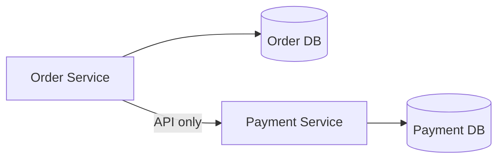
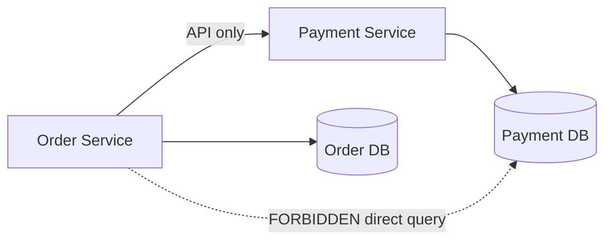

# 06 — Data Management

> **Part:** II Core Architecture | **Week:** 5 | **Exercises:** [module-06](../../exercises/module-06.md)

## Learning outcomes

After this module you can:

1. Apply database-per-service and explain why shared DB fails
2. Explain CAP theorem and choose AP vs CP for a scenario
3. Design Saga workflows with compensating transactions
4. Describe Outbox pattern and cross-service query options

---

## Database-per-service

Each service owns its data store. No direct cross-DB access.



Benefits: schema independence, polyglot persistence, independent scaling, failure isolation.

### Data ownership flow (no shared DB)



Data **never** flows directly between databases — only through service APIs or events.

See [DATA-FLOW-AND-SYSTEM-DESIGN.md](../DATA-FLOW-AND-SYSTEM-DESIGN.md) for Level 1 DFD and saga failure flows.

---

## Distributed data problem

Monolith: one transaction across tables. Microservices: no single ACID transaction across services.

---

## CAP theorem

Under partition, choose **CP** (consistent, may reject) or **AP** (available, may be stale). Partitions happen → most microservices use **AP + eventual consistency**.

---

## Eventual consistency

Data converges over time via events. Acceptable for many reads; financial flows need Saga + compensation.

---

## Saga pattern

Sequence of local transactions with compensating actions on failure.

```
Forward:  Create Order → Charge Payment → Reserve Inventory → Confirm
Failure at Inventory: Refund Payment → Cancel Order
```

| Type | Pros | Cons |
|------|------|------|
| Orchestrated | Clear state, central rollback | Orchestrator coupling |
| Choreographed | Loose coupling | Harder to trace |

**Time complexity:** n steps forward; up to n compensations → O(n) worst case (Module 10).

---

## Outbox pattern

Atomically write business data + outbox row; relay publishes to broker. Guarantees event eventually sent if DB commit succeeds.

---

## Data duplication (intentional)

| Data | Owner | Copy in |
|------|-------|---------|
| Product name | Catalog | Order (snapshot) |
| Customer email | User | Notification |

Synced via events — denormalization for autonomy and read performance.

---

## Querying across services

| Approach | Performance | Complexity |
|----------|-------------|------------|
| API composition | Slow (N calls) | Low |
| CQRS read model | Fast reads | High |
| GraphQL federation | Flexible | Medium |

**Performance anti-pattern:** N+1 cross-service calls for list views — use read model or event-carried state.

---

## Database scaling (preview)

| Strategy | Use when |
|----------|----------|
| Read replicas | Read-heavy, stale OK |
| Sharding | Write-heavy, single DB limit |
| Caching | Hot keys, frequent reads |

Details in Module 08.

---

## Exercises

See [exercises/module-06.md](../../exercises/module-06.md).

## Next module

[07 — Reliability & Resilience →](./07-reliability-and-resilience.md)
