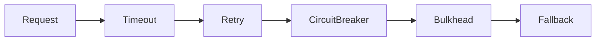

# 07 — Reliability & Resilience

> **Part:** II Core Architecture | **Week:** 6 | **Exercises:** [module-07](../../exercises/module-07.md)

## Learning outcomes

After this module you can:

1. Identify failure modes in distributed systems
2. Configure timeouts, retries, and circuit breakers appropriately
3. Apply bulkhead and graceful degradation patterns
4. Relate resilience patterns to tail latency (p99)

---

## Failure modes

| Type | Example |
|------|---------|
| Service crash | OOM in Payment Service |
| Timeout | Network hang |
| Slow response | Catalog overloaded (30s) |
| Partial data | User Service down |
| Cascading failure | A waits for B waits for C |

---

## Timeouts

Never wait forever. Typical HTTP: 1–5s. **Rule:** callee timeout &lt; caller timeout.

Without timeouts → thread pool exhaustion → cascading failure.

**Performance link:** Timeouts cap tail latency; they don't fix slow dependencies but prevent unbounded waits.

---

## Retries

For transient failures (503, timeout). Use exponential backoff + jitter. Max 2–3 retries. **Idempotent operations only.**

Retry storm risk: combine with circuit breaker.

---

## Circuit breaker

States: **Closed** → **Open** (fail fast) → **Half-Open** (test one call).

After 5 failures in 10s → open 30s → protects downstream and caller resources.

**Performance:** Open circuit returns immediately — better p99 than waiting full timeout.

---

## Bulkhead

Isolate thread/connection pools per dependency. Payment failure consumes max 20 threads, not all 100.

---

## Fallback & graceful degradation

| Dependency down | Fallback |
|-----------------|----------|
| Recommendations | Popular items |
| Reviews | Hide reviews section |
| User profile | Show user ID |

---

## Rate limiting

Token bucket, fixed/sliding window at gateway or service. Protects throughput under attack or spike.

---

## Health checks

| Probe | Purpose |
|-------|---------|
| Liveness | Process alive? Restart if not |
| Readiness | Can accept traffic? |
| Startup | Initialization complete? |

---

## Resilience stack summary

---

## Exercises

See [exercises/module-07.md](../../exercises/module-07.md).

## Next module

[08 — Scalability Patterns →](./08-scalability-patterns.md)
