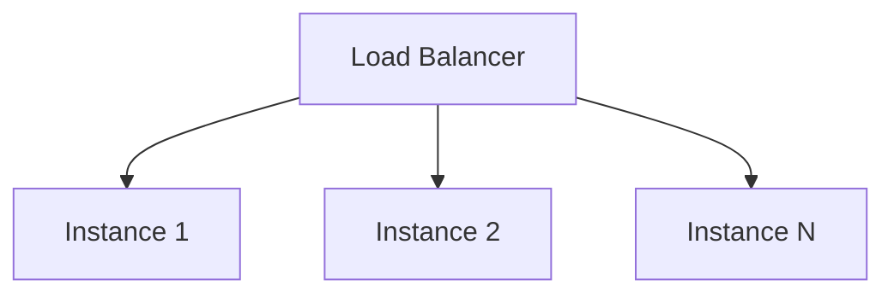
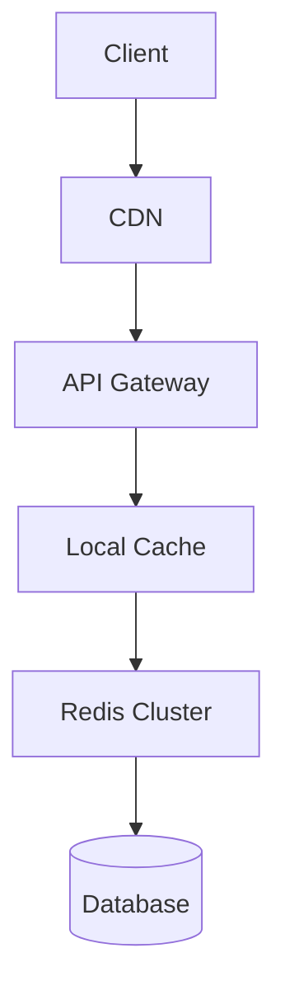

# 08 — Scalability Patterns

> **Part:** II Core Architecture | **Week:** 7 | **Exercises:** [module-08](../../exercises/module-08.md)

## Learning outcomes

After this module you can:

1. Distinguish scalability, elasticity, and performance
2. Compare vertical vs horizontal scaling and stateless vs stateful services
3. Design load balancing, sharding, read replicas, and caching layers
4. Explain why microservices enable independent per-service scaling

---

## Definitions

| Term | Meaning |
|------|---------|
| **Scalability** | Handle growth by adding resources |
| **Elasticity** | Scale up/down automatically with demand |
| **Performance** | Speed of individual requests |
| **Flexibility** | Change/deploy parts independently |

Microservices excel at **organizational scalability** and **targeted horizontal scaling** — not automatic raw speed.

---

## Vertical vs horizontal scaling

### Vertical (scale up)
Add CPU/RAM to one machine.

| Pros | Cons |
|------|------|
| Simple | Hardware ceiling |
| No code changes | Single point of failure |
| | Expensive at top end |

### Horizontal (scale out)
Add more machines/instances.

| Pros | Cons |
|------|------|
| No hard ceiling | Load balancing required |
| Fault tolerance | Distributed data complexity |
| Cost-effective at scale | Stateless design preferred |

**Rule:** Start vertical for small scale; plan horizontal for production growth.

---

## Stateless vs stateful services

| Stateless | Stateful |
|-----------|----------|
| No session in memory | Session/sticky state |
| Any instance handles request | Sticky sessions or externalized state |
| Easy horizontal scale | Harder to scale |

**Best practice:** Externalize state to Redis/DB; keep services stateless.

---

## Independent per-service scaling (key microservices benefit)

During a sale:
- Order Service: 20 instances
- Catalog Service: 10 instances
- Admin Service: 2 instances

Monolith would scale **everything** 20× including unused Admin code.

---

## Load balancing

| Layer | Examples | Decisions |
|-------|----------|-----------|
| L4 (transport) | TCP pass-through | Fast, no HTTP awareness |
| L7 (application) | NGINX, Envoy, ALB | Path routing, headers |

| Algorithm | Behavior |
|-----------|----------|
| Round robin | Rotate evenly |
| Least connections | Send to least busy |
| Consistent hashing | Same key → same node (cache affinity) |

---

## Database scaling

### Read replicas
Primary for writes; replicas for reads. **Eventual consistency** on reads.

### Sharding (partitioning)
Split data by key (tenant_id, user_id, region).

| Strategy | Key choice |
|----------|------------|
| Range | Simple, hot spots risk |
| Hash | Even distribution |
| Directory | Flexible mapping |

**Complexity:** Cross-shard queries expensive — design boundaries to avoid them.

### Per-service DB
Each service scales its own database technology (Postgres vs Mongo vs Elasticsearch).

---

## Caching layers

| Pattern | Description |
|---------|-------------|
| Cache-aside | App reads cache; on miss, read DB and populate |
| Write-through | Write cache + DB together |
| CDN | Static assets, edge caching |

**Scalability:** Cache reduces DB load → higher read throughput.

Watch: cache invalidation, stampede on expiry (Module 09).

---

## Async decoupling for scale

Queue between producer and consumer:
- Absorbs traffic spikes (buffer)
- Scale consumers based on queue depth (K8s HPA custom metric)

---

## Autoscaling

| Trigger | Example |
|---------|---------|
| CPU/memory | HPA on Order Service |
| Queue depth | Payment workers scale with backlog |
| Request rate | Gateway scale on RPS |

**Elasticity:** Scale down off-peak to save cost (Module 19).

---

## Multi-tenancy models

| Model | Isolation | Scale |
|-------|-----------|-------|
| Silo | DB per tenant | Highest isolation, higher cost |
| Pool | Shared DB, tenant column | Efficient, row-level security |
| Bridge | Hybrid | Balance cost/isolation |

---

## Common mistakes

| Mistake | Fix |
|---------|-----|
| Scaling monolith as only strategy | Split hot path services |
| Sticky sessions without plan | Externalize session state |
| Cache everything forever | TTL + invalidation strategy |
| Sharding too early | Scale vertically/replicas first |

---

## Exercises

See [exercises/module-08.md](../../exercises/module-08.md).

## Next module

[09 — Performance Engineering →](./09-performance-engineering.md)
