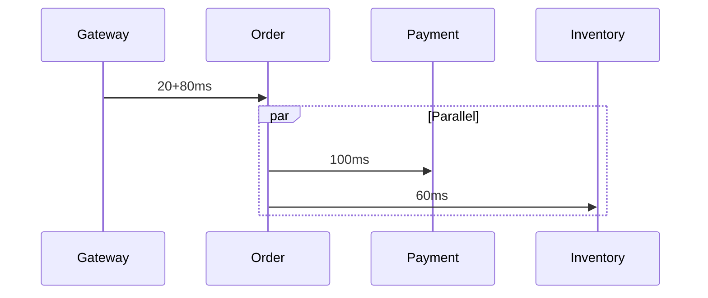

# 09 — Performance Engineering

> **Part:** II Core Architecture | **Week:** 7–8 | **Exercises:** [module-09](../../exercises/module-09.md)

## Learning outcomes

After this module you can:

1. Decompose an end-to-end latency budget across services
2. Interpret p50, p95, p99, and p999 for SLO design
3. Identify and fix sync-chain and chatty API performance problems
4. Apply connection pooling, batching, caching, and backpressure

---

## Latency vs throughput

| Term | Question |
|------|----------|
| Latency | How long for **one** request? |
| Throughput | How many requests **per second**? |

High throughput with batching can increase individual latency. Optimize the **hot path** users feel.

---

## Percentiles (never trust average alone)

| Metric | Meaning |
|--------|---------|
| p50 | Median experience |
| p95 | 1 in 20 slow — tail begins |
| p99 | 1 in 100 — user complaints |
| p999 | Worst realistic cases for payment/checkout |

SLO example: "99% of checkout requests complete in &lt; 500ms."

---

## Latency budget

Allocate total user-facing time across hops. Leave margin for retries and variance.

### Worked example: 300ms checkout budget

| Hop | Budget |
|-----|--------|
| API Gateway | 20ms |
| Order Service | 80ms |
| Payment Service | 100ms |
| Inventory Service | 60ms |
| Margin | 40ms |

**Parallel path:** Payment and Inventory in parallel → critical path = 20 + 80 + max(100, 60) + 40 = **240ms** ✓



**Rules:**
- Each service timeout &lt; caller's timeout
- Gateway timeout &gt; sum of critical path + margin
- Measure p99, not mean, when allocating

---

## Sync chain penalty

Sequential k synchronous calls:

```
Total latency ≈ L1 + L2 + ... + Lk   → O(k)
```

If each hop is 30ms p99, 5 hops = 150ms minimum — before processing time.

**Fixes:** Parallel fan-out, async events, aggregate API (BFF), caching.

---

## gRPC vs REST performance

| Factor | REST/JSON | gRPC/Protobuf |
|--------|-----------|---------------|
| Serialization | Slower, larger | Faster, compact |
| HTTP | 1.1 or 2 | HTTP/2 multiplex |
| Use case | Public, human-debug | Internal high-RPS |

For hot internal paths, gRPC often reduces CPU and bytes on the wire.

---

## Connection pooling

New TCP + TLS handshake per request: expensive (1–3 RTTs).

**Pool** persistent connections between services. Critical at high QPS.

---

## Batching and pagination

| Anti-pattern | Fix |
|--------------|-----|
| 100 HTTP calls for 100 IDs | `POST /products/batch` |
| Return 10MB list | Cursor pagination |
| Chatty orchestration | Event-carried state transfer |

---

## Backpressure

When downstream is overloaded, slow upstream instead of queueing infinitely.

Signals: HTTP 429, queue max length, reject with retry-after.

Prevents memory exhaustion and cascading latency spikes.

---

## Hot path vs cold path

| Path | Optimize? | Example |
|------|-----------|---------|
| Hot | Aggressively | Checkout, search |
| Cold | Good enough | Monthly report generation |

Don't over-engineer admin analytics to the same p99 as payment.

---

## Caching for performance

| Metric | Target |
|--------|--------|
| Hit ratio | Higher = fewer DB calls |
| TTL | Balance freshness vs load |
| Stampede | Lock or probabilistic early expiry on hot keys |

---

## Database-per-service performance

| Problem | Symptom | Fix |
|---------|---------|-----|
| N+1 calls | List page slow | Read model, batch API |
| Cross-service join | High latency | Denormalize via events |
| Over-fetching | Large payloads | DTO projection, GraphQL |

---

## Common mistakes

| Mistake | Fix |
|---------|-----|
| No latency budget | Document and enforce per hop |
| Optimizing mean latency | Track p99 |
| Sync chain on hot path | Parallelize or async |
| No connection pooling | Pool at gateway and clients |

---

## Exercises

See [exercises/module-09.md](../../exercises/module-09.md).

## Next module

[10 — Time Complexity in Distributed Systems →](./10-time-complexity.md)
