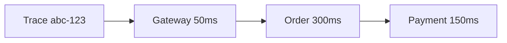

# 12 — Observability & SLOs

> **Part:** III Production | **Week:** 9–10 | **Exercises:** [module-12](../../exercises/module-12.md)

## Learning outcomes

After this module you can:

1. Apply the three pillars: logs, metrics, traces
2. Define SLI, SLO, SLA, and error budget
3. Correlate observability data using traceId
4. Design actionable alerts for latency and error spikes

---

## Why observability matters

One user request may touch 5–10 services. You must answer: **why slow? why failed? what breaks next?**

Observability > monitoring (not just up/down).

---

## Three pillars

### Logs — what happened
Structured JSON with traceId, service, timestamp, business IDs. Centralize (ELK, Loki).

### Metrics — how system performs
Counters, gauges, histograms. Track RPS, error rate, p99 latency, CPU. Prometheus + Grafana.

### Traces — request journey
Trace = spans across services. OpenTelemetry → Jaeger/Tempo. **traceId** links all three pillars.

---

## SLI, SLO, SLA

| Term | Definition |
|------|------------|
| SLI | Metric measuring quality (e.g., % requests &lt; 500ms) |
| SLO | Target for SLI (e.g., 99.9%) |
| SLA | Contract with customer consequences |
| Error budget | Allowed failure = 100% - SLO |

When budget exhausted → stop features, fix reliability.

---

## Alerting

Alert on **symptoms** (error rate, p99), not causes (CPU 60%). Critical = page on-call; warning = business hours.

---

## Instrument from day one

Structured logs, health endpoints, basic metrics, trace propagation — retrofitting is painful.

---

## Performance link

p99 latency metrics drive SLOs and capacity decisions (Modules 09, 19).

---

## Exercises

See [exercises/module-12.md](../../exercises/module-12.md).

## Next module

[13 — Deployment & DevOps →](./13-deployment-and-devops.md)
