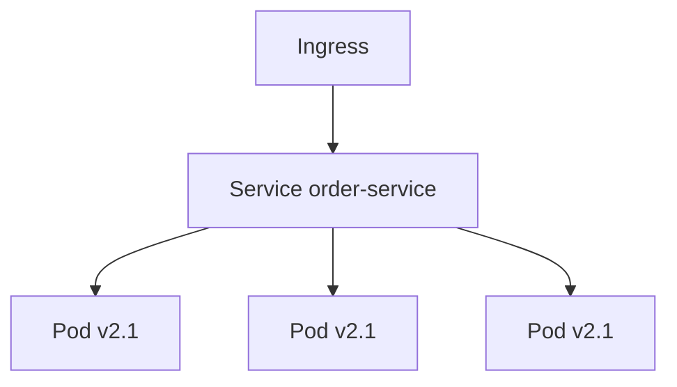

# 13 — Deployment & DevOps

> **Part:** III Production | **Week:** 10 | **Exercises:** [module-13](../../exercises/module-13.md)

## Learning outcomes

After this module you can:

1. Explain containers and Kubernetes core concepts for microservices
2. Design CI/CD pipeline per service with independent deploy
3. Compare rolling, blue-green, and canary deployment strategies
4. Configure HPA autoscaling and externalized configuration

---

## Deployment challenge

N services = N pipelines, N artifacts, N runtimes. DevOps maturity is mandatory.

---

## Containers

Package app + dependencies. Portable, isolated, fast start. One image per microservice.

---

## Kubernetes essentials

| Concept | Role |
|---------|------|
| Pod | Smallest deploy unit |
| Deployment | Replicas, rolling updates |
| Service | Stable DNS + load balance |
| Ingress | External routing |
| ConfigMap/Secret | External config |
| HPA | Autoscale on CPU/custom metrics |

---

## CI/CD per service

Build → Test → Package image → Deploy staging → Smoke → Production. Same immutable image promoted. Auto-rollback on failed health checks.

**Flexibility:** Deploy Order Service without touching Payment Service.

---

## Deployment strategies

| Strategy | Risk | Rollback |
|----------|------|----------|
| Rolling | Two versions briefly | Redeploy previous |
| Blue-green | Needs 2x infra briefly | Switch traffic back |
| Canary | Lowest blast radius | Stop traffic shift |

Canary uses metrics (error rate, p99) to gate rollout — links to Module 12.

---

## Autoscaling (HPA)

Scale pods on CPU, memory, or custom metrics (queue depth, RPS). **Elasticity** for cost and performance under load.

---

## Infrastructure as Code

Terraform, Helm, Kustomize — reproducible environments, reviewable infra changes.

---

## GitOps

Git as source of truth for deployment state. ArgoCD/Flux sync cluster to repo.

---

## Config rule

Never bake environment config into images. Inject at runtime via ConfigMap/Secret.

---

## Exercises

See [exercises/module-13.md](../../exercises/module-13.md).

## Next module

[14 — Flexibility & Evolvability →](./14-flexibility-and-evolvability.md)
