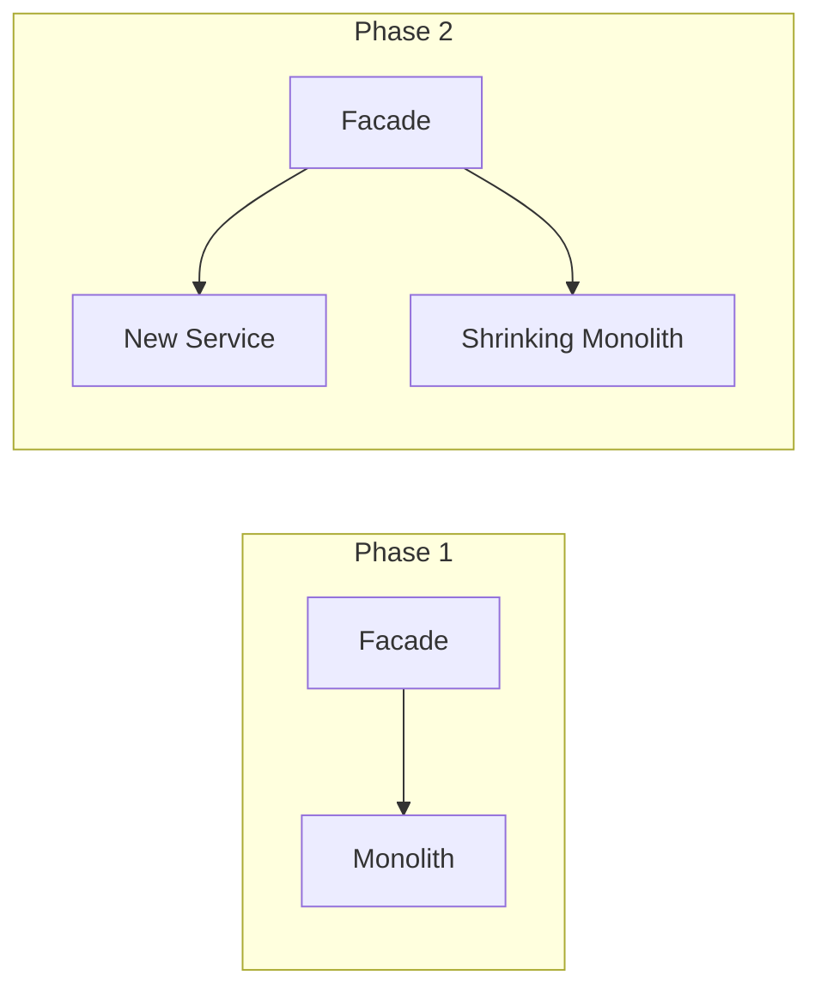

# 14 — Flexibility & Evolvability

> **Part:** III Production | **Week:** 11 | **Exercises:** [module-14](../../exercises/module-14.md)

## Learning outcomes

After this module you can:

1. Explain how microservices enable organizational and technical flexibility
2. Apply independent deployment, feature flags, and canary releases
3. Use Strangler Fig and anti-corruption layer for migration
4. Design API evolution with backward compatibility

---

## What flexibility means in microservices

| Dimension | Flexibility gain |
|-----------|------------------|
| Deployment | Release one service without redeploying all |
| Technology | Polyglot persistence and languages per service |
| Team | Autonomous teams own services end-to-end |
| Replacement | Rewrite one service without touching others |
| Scale | Scale only what needs it |

**Trade-off:** Flexibility increases operational and integration complexity.

---

## Independent deployment

Requirements for true independence:
- Backward-compatible API changes
- Versioned APIs when breaking unavoidable
- No shared libraries requiring lockstep updates
- Contract tests between consumer and provider (Module 15)

---

## Feature flags

Toggle behavior without redeploy. Enable canary features for 5% users. Roll back instantly by flipping flag.

---

## Polyglot persistence

| Service | DB choice | Why |
|---------|-----------|-----|
| Catalog | MongoDB | Flexible product schema |
| Order | Postgres | ACID for orders |
| Search | Elasticsearch | Full-text search |

Each team picks best tool — **flexibility** at cost of ops diversity.

---

## Technology migration: Strangler Fig

Gradually replace monolith with services:

Extract one bounded context at a time. Low risk, continuous delivery.

---

## Anti-corruption layer

Translate legacy/external models into your domain at integration boundary. Protects service from upstream model changes.

---

## API evolution rules

| Safe | Breaking |
|------|----------|
| Add optional fields | Remove fields |
| Add new endpoints | Change field types |
| Deprecate with timeline | Rename without version |

Support v1 and v2 in parallel during transition.

---

## Config externalization

Change rate limits, feature toggles, timeouts via config server — no image rebuild.

---

## Extensibility patterns

- **Event hooks:** `OrderCreated` lets new services subscribe without changing Order Service
- **Plugin architecture:** For regulated optional modules

---

## Organizational flexibility (Conway's Law)

Team structure and architecture co-evolve. Platform team provides templates, CI/CD, observability — stream-aligned teams own services.

---

## Common mistakes

| Mistake | Fix |
|---------|-----|
| Distributed monolith (deploy together) | Merge or decouple properly |
| Breaking API without version | Parallel version support |
| Big-bang rewrite | Strangler Fig |

---

## Exercises

See [exercises/module-14.md](../../exercises/module-14.md).

## Next module

[15 — Testing & Contract Design →](./15-testing-and-contracts.md)
