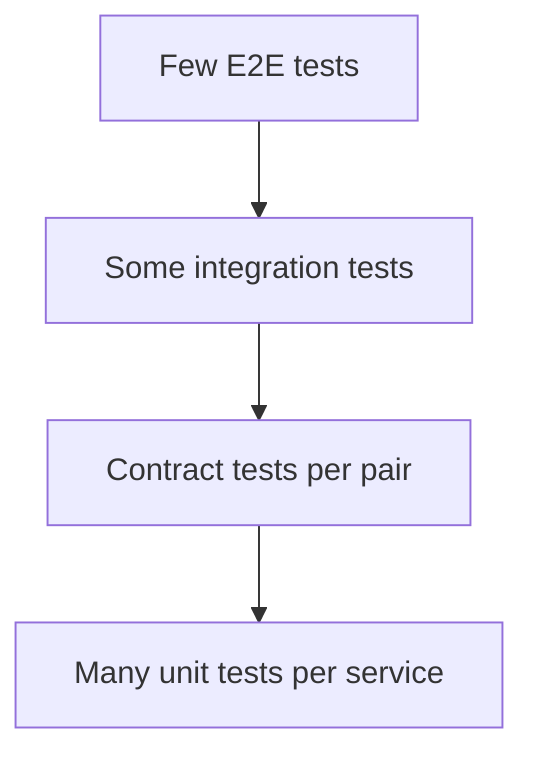

# 15 — Testing & Contract Design

> **Part:** III Production | **Week:** 11–12 | **Exercises:** [module-15](../../exercises/module-15.md)

## Learning outcomes

After this module you can:

1. Design a test pyramid appropriate for microservices
2. Explain consumer-driven contract testing (Pact)
3. Choose what to test in isolation vs integration vs E2E
4. Validate performance and resilience in test strategy

---

## Testing challenge

Services are distributed. Full E2E requires many running components — slow, flaky, expensive.

---

## Test pyramid for microservices

| Layer | Scope | Speed |
|-------|-------|-------|
| Unit | One service, mocked deps | Fast |
| Contract | API between consumer/provider | Fast |
| Integration | Service + real DB/broker | Medium |
| E2E | Full user journey | Slow |

**Rule:** Many unit + contract; few E2E.

---

## Consumer-driven contracts

Consumer defines expected request/response. Provider verifies against contract. Catches breaking API changes before deploy.

Tools: Pact, Spring Cloud Contract.

**Flexibility enabler:** Teams deploy independently with confidence.

---

## What to mock vs run real

| Mock | Run real |
|------|----------|
| Other microservices (unit) | Own database (integration) |
| External payment gateway | Message broker (integration) |
| Clock/random | Contract test fixtures |

---

## Integration testing

Test service with real Postgres/Redis in CI (Testcontainers). Verify repository and messaging layers.

---

## E2E testing

Critical paths only: signup, checkout, payment. Run in staging; keep count low.

---

## Performance testing

Load test hot paths before launch (Module 19). Validate p99 under expected QPS.

---

## Chaos / resilience testing

Inject failures (service down, latency) in staging. Verify circuit breakers and fallbacks (Module 07).

---

## Common mistakes

| Mistake | Fix |
|---------|-----|
| Only E2E tests | Build pyramid |
| No contract tests | Add Pact per API pair |
| Testing in production only | Staging + load tests |

---

## Exercises

See [exercises/module-15.md](../../exercises/module-15.md).

## Next module

[16 — Advanced Patterns →](../part-04-advanced/16-advanced-patterns.md)
