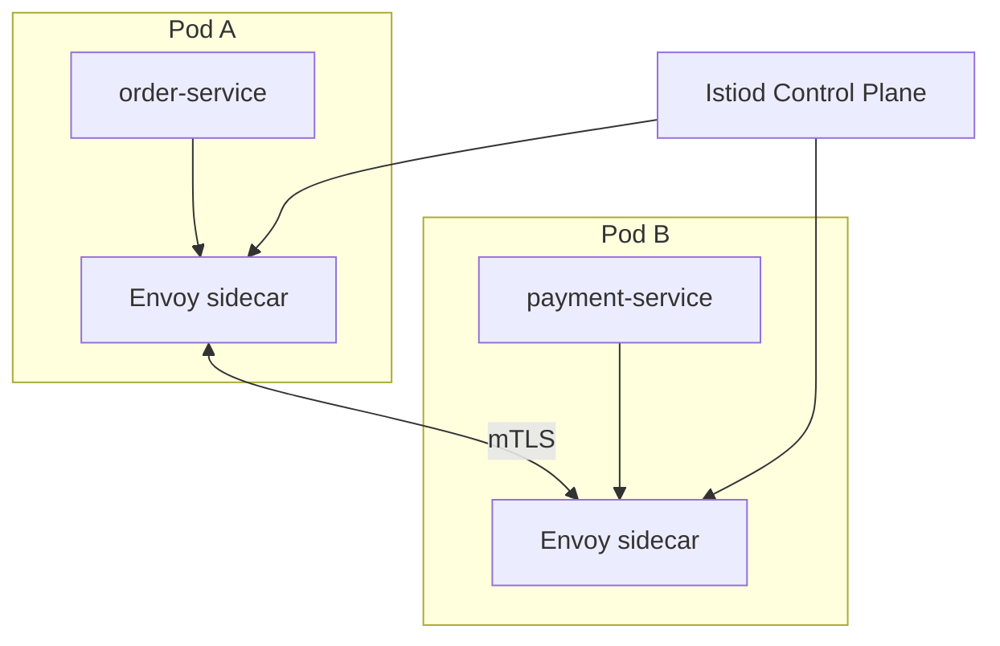

# 17 — API Gateway & Service Mesh

> **Part:** IV Advanced | **Week:** 13 | **Exercises:** [module-17](../../exercises/module-17.md)

## Learning outcomes

After this module you can:

1. List API Gateway responsibilities vs load balancer
2. Explain service mesh data plane and control plane
3. Compare library-based resilience vs mesh-based (Istio, Linkerd)
4. Decide when mesh complexity is justified

---

## API Gateway deep dive

| Function | Detail |
|----------|--------|
| Routing | Path-based to services |
| AuthN/Z | JWT validation |
| Rate limiting | Protect backends |
| TLS termination | Edge HTTPS |
| Caching | GET response cache |
| Transformation | External vs internal API shape |

Products: Kong, NGINX, AWS API Gateway, Envoy.

**Performance:** Gateway adds one hop — budget 10–30ms; cache hot paths.

---

## Service mesh

Dedicated infrastructure layer for service-to-service traffic.

### Mesh provides
- Automatic mTLS
- Retries, timeouts, circuit breaking at proxy
- Traffic splitting (canary)
- Metrics and traces without app code changes

### When to adopt
- 10+ services, repetitive cross-cutting concerns
- Strong mTLS requirement

### When to skip
- Small service count, team lacks mesh ops skills

| | Library (Resilience4j) | Mesh |
|---|------------------------|------|
| Language | Per-language | Polyglot |
| Ops | App team | Platform team |
| Overhead | In-process | Sidecar CPU/memory |

---

## Exercises

See [exercises/module-17.md](../../exercises/module-17.md).

## Next module

[18 — Multi-Region HA & DR →](./18-multi-region-ha-dr.md)
