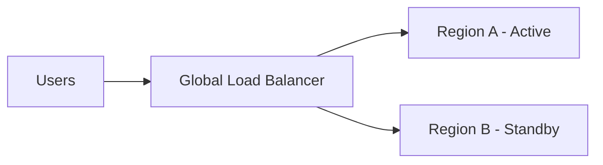

# 18 — Multi-Region HA & Disaster Recovery

> **Part:** IV Advanced | **Week:** 13 | **Exercises:** [module-18](../../exercises/module-18.md)

## Learning outcomes

After this module you can:

1. Compare active-active vs active-passive multi-region designs
2. Define RPO and RTO for microservices systems
3. Explain data consistency challenges across regions
4. Outline failover strategy for critical services

---

## High availability vs disaster recovery

| Term | Meaning |
|------|---------|
| HA | Minimize downtime during failures |
| DR | Recover after major outage (region loss) |

---

## Multi-region patterns

| Pattern | Description | Complexity |
|---------|-------------|------------|
| Active-passive | Standby region for failover | Lower |
| Active-active | Both regions serve traffic | Higher (data sync) |

---

## RPO and RTO

| Metric | Question |
|--------|----------|
| RPO (Recovery Point Objective) | Max data loss acceptable? |
| RTO (Recovery Time Objective) | Max downtime acceptable? |

Payment service: RPO ≈ 0, RTO minutes. Analytics: RPO hours, RTO hours.

---

## Data across regions

- **Async replication:** Lower latency writes, eventual consistency across regions
- **Conflict resolution:** Last-write-wins, vector clocks, or domain-specific merge
- **Global databases:** CockroachDB, Spanner — strong consistency, higher cost/latency

**CAP:** Cross-region = partitions likely → AP or careful CP design.

---

## Service-level DR

Each service defines:
- Backup/restore procedures
- Failover runbook
- Dependency map (what breaks if Payment region fails)

---

## Chaos and DR drills

Regular failover tests. Module 07 resilience + Module 12 observability required.

---

## Exercises

See [exercises/module-18.md](../../exercises/module-18.md).

## Next module

[19 — Capacity Planning & Cost →](./19-capacity-planning-and-cost.md)
