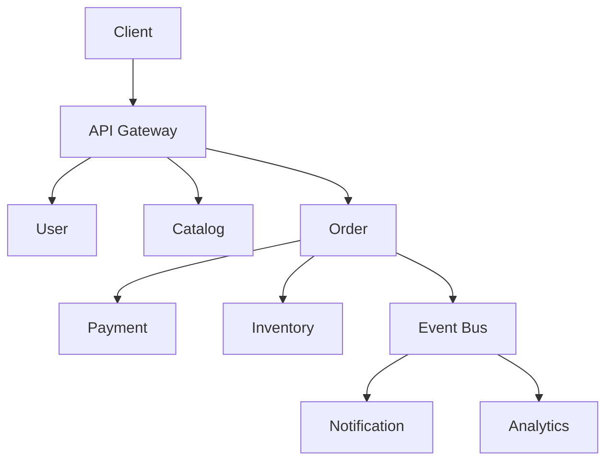

# 21 — Capstone Architecture Projects

> **Part:** IV Advanced | **Week:** 16 | **Exercises:** [module-21](../../exercises/module-21.md)

## Learning outcomes

After this module you can:

1. Design a complete e-commerce microservices architecture document
2. Include latency budget, scalability plan, and complexity analysis
3. Document trade-offs and rejected alternatives
4. Present architecture suitable for production review

---

## Capstone deliverable

Produce an **Architecture Design Document (ADD)** for an e-commerce platform covering all course topics.

---

## Required sections

### 1. Context & requirements
- Business goals, expected DAU, peak QPS
- Non-functional: p99 latency, availability SLO, compliance (PCI)

### 2. Service map & system design
Services: User, Catalog, Cart, Order, Payment, Inventory, Notification, Search, Analytics.

**Required diagrams** (templates in [DATA-FLOW-AND-SYSTEM-DESIGN.md](../DATA-FLOW-AND-SYSTEM-DESIGN.md)):

| Diagram | Include in capstone |
|---------|---------------------|
| Context DFD (Level 0) | Yes |
| Level 1 DFD (services + DBs) | Yes |
| System design (containers) | Yes |
| Checkout sequence diagram | Yes |
| Event flow (async) | Yes |
| Saga failure flow | Yes |
| Deployment diagram | Recommended |

### 3. Bounded contexts & data
- DB per service table
- Event list (OrderCreated, PaymentCompleted, etc.)
- Saga for checkout failure compensation

### 4. Communication
- Sync vs async choices with rationale
- Orchestration vs choreography for checkout

### 5. Scalability plan
- Which services scale horizontally and triggers (HPA metrics)
- Caching strategy (CDN, Redis)
- Sharding if needed for Order/Analytics

### 6. Performance
- 300ms checkout latency budget table
- Parallel vs sequential call diagram
- p99 SLO per service

### 7. Time complexity analysis
- Sequential vs parallel design for product page
- Saga O(n) failure analysis

### 8. Resilience & security
- Timeouts, circuit breakers, fallbacks
- JWT at gateway, mTLS internal, PCI isolation for Payment

### 9. Observability
- SLIs/SLOs, trace propagation, key dashboards

### 10. Deployment & flexibility
- CI/CD per service, canary strategy
- Strangler Fig note if migrating from monolith

### 11. Trade-offs & ADRs
- At least 3 ADRs (e.g., Kafka vs RabbitMQ, sync vs async payment verify)

---

## Evaluation rubric

| Criterion | Weight |
|-----------|--------|
| Clear service boundaries (DDD) | 20% |
| Scalability & performance depth | 25% |
| Time complexity / latency budget | 15% |
| Resilience, security, observability | 20% |
| Trade-offs & ADRs | 20% |

---

## Optional extensions

- Multi-region active-passive design
- Cost estimate for 1M DAU
- Contract test strategy between Order and Payment

---

## Exercises

Full capstone spec: [exercises/module-21.md](../../exercises/module-21.md).

## Course complete

Review [LEARNING-CHECKLIST.md](../../LEARNING-CHECKLIST.md) and [appendices/D-interview-prep.md](../appendices/D-interview-prep.md).
