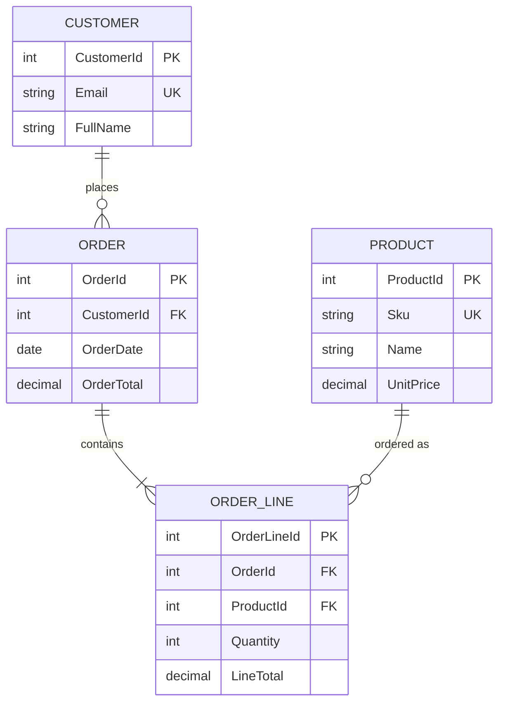

# 07 — Database Design, DBMS Concepts & ERD

> **Part:** I Foundations (also Module 03) | **Exercises:** [module-03](../exercises/module-03.md) | **Merged guide:** [03-data-modeling.md](part-01-foundations/03-data-modeling.md)

## Learning outcomes

1. Draw ERD with correct cardinality  
2. Apply normalization to 3NF  
3. Map entities to DDL with keys and constraints  

## What is a DBMS?

A **Database Management System** is software that:

- Stores data persistently
- Enforces **integrity** (keys, constraints)
- Controls **concurrent access** (locking, isolation)
- Provides **security** and **recovery**

SQL Server is a **relational DBMS (RDBMS)** using tables and SQL.

---

## Design process (recommended)

```
1. Requirements  →  entities, rules, reports
2. Conceptual    →  ERD (entities + relationships)
3. Logical       →  tables, keys, normalization
4. Physical      →  types, indexes, partitioning
5. Implement     →  T-SQL DDL + migrations
6. Validate      →  tests, load, security review
```

---

## Entity-Relationship Diagram (ERD)

### Symbols (Chen / common notation)

| Symbol | Meaning |
|--------|---------|
| Rectangle | **Entity** (becomes a table) |
| Oval | **Attribute** (column) |
| Diamond | **Relationship** |
| Lines | Cardinality: 1:1, 1:N, M:N |

### Example: E-commerce (conceptual)



**Cardinality:**

- One customer → **many** orders (`||--o{`)
- One order → **many** line items
- Many-to-many (Order ↔ Product) is resolved by **ORDER_LINE** junction table

---

## Normalization (reduce redundancy)

| Normal form | Rule (simplified) |
|-------------|---------------------|
| **1NF** | Atomic columns; no repeating groups |
| **2NF** | No partial dependency on composite key |
| **3NF** | No transitive dependency (A→B→C stored wrong) |
| **BCNF** | Every determinant is a candidate key |

**Denormalize** intentionally for read performance (warehouses, reports)—document why.

---

## Keys

| Key | Purpose |
|-----|---------|
| **Primary key** | Unique row identifier |
| **Foreign key** | References parent table; enforces referential integrity |
| **Natural key** | Business meaning (email, SKU) — use carefully |
| **Surrogate key** | `IDENTITY` / `GUID` — stable, narrow indexes |

**Tip:** Surrogate `INT` PK + unique constraint on natural key is common.

---

## Physical design for flexibility

| Decision | Scalability / flexibility |
|----------|---------------------------|
| Narrow PK types | Faster joins, smaller indexes |
| Separate lookup tables | Change codes without app deploy |
| Nullable vs NOT NULL | Clearer data meaning |
| `DATETIME2` UTC | Multi-timezone apps |
| Soft delete (`IsDeleted`) | Audit; complicates unique indexes |
| Extensibility table (EAV) | Flexible schema; harder to query—avoid unless needed |

---

## Sample DDL from ERD

See [sql/01-create-sample-database.sql](../sql/01-create-sample-database.sql) and [sql/02-ddl-basics.sql](../sql/02-ddl-basics.sql).

---

## Tools for ERD

- **SSMS** — Database Diagrams (small schemas)
- **Azure Data Studio** + extensions
- **dbdiagram.io**, **Draw.io**, **ER/Studio**, **Visio**

Export ERD PNG/PDF into your project wiki.

---

## Practice exercises

1. Draw ERD for a **library** (Book, Member, Loan).
2. Identify M:N relationships and junction tables.
3. Normalize: “Order stores CustomerName, CustomerCity” — what’s wrong?
4. Write DDL with FK from Loan → Book and Member.

---

## Next

[08-data-flow-architecture.md](08-data-flow-architecture.md)
