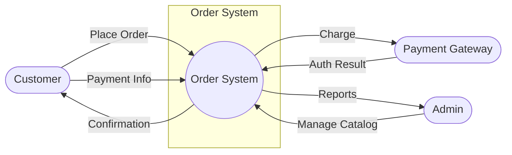
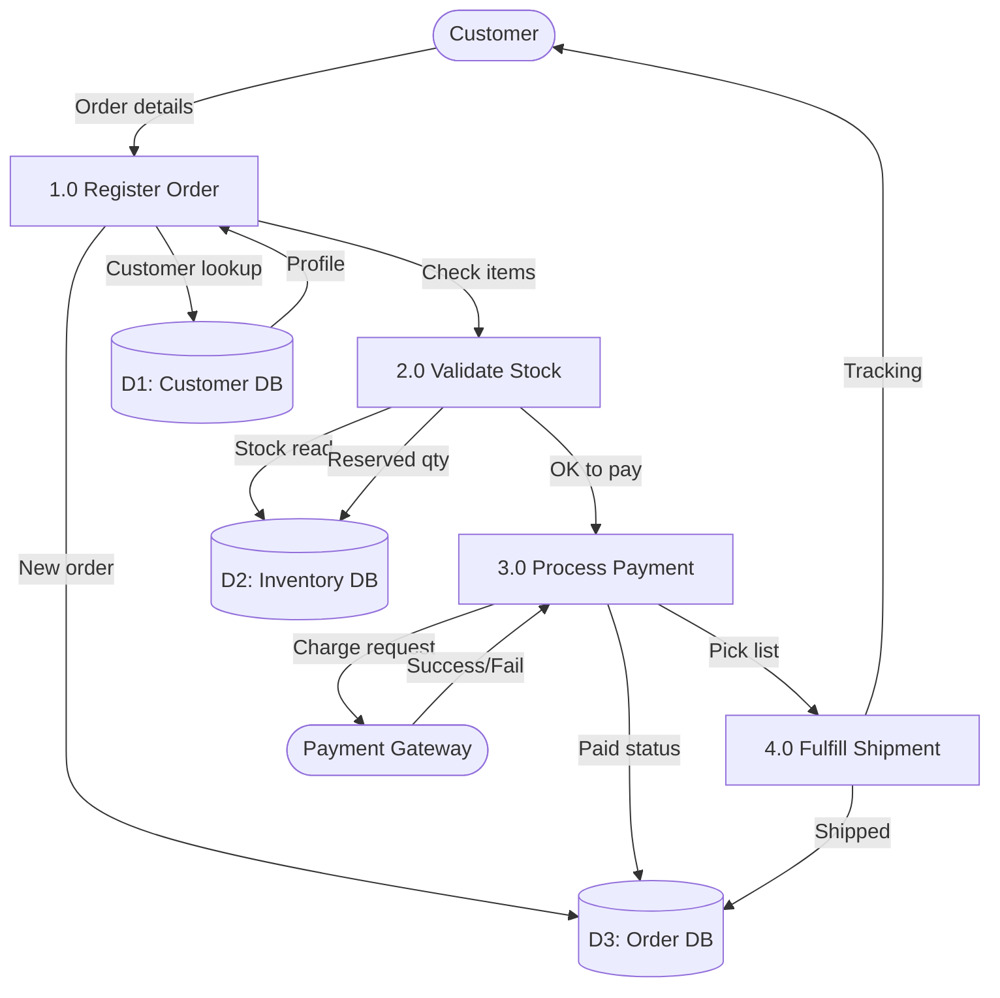
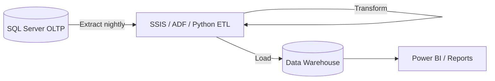

# 08 — Data Flow Diagrams & System Architecture

A **Data Flow Diagram (DFD)** shows how data **moves** between external entities, processes, and data stores—not table columns like an ERD.

---

## DFD levels

| Level | Shows |
|-------|-------|
| **Context (0)** | System as one bubble + external actors |
| **Level 1** | Major processes inside system |
| **Level 2+** | Detail inside one process |

---

## Symbols (Yourdon / Gane-Sarson style)

| Symbol | Name | Example |
|--------|------|---------|
| Square | External entity | Customer, Payment Gateway |
| Circle / rounded rect | Process | Validate Order, Post Payment |
| Open rectangle | Data store | D1: Orders DB |
| Arrow | Data flow | OrderRequest, Receipt |

---

## Context diagram (example: online shop)



---

## Level 1 DFD (processes + data store)



**Mapping to SQL Server:**

- D1, D2, D3 often = databases or schemas
- Processes = app services, stored procedures, ETL packages
- Flows = API payloads, message queues, batch files

---

## Architecture for high scalability

```
                    ┌─────────────┐
  Users ──────────►│ Load Balancer│
                    └──────┬──────┘
           ┌───────────────┼───────────────┐
           ▼               ▼               ▼
      App Server 1    App Server 2    App Server N
           │               │               │
           └───────────────┼───────────────┘
                           ▼
              ┌────────────────────────┐
              │  SQL Server (Primary)   │
              │  + Read Replicas (AG)   │
              └────────────────────────┘
                           │
              ┌────────────┴────────────┐
              ▼                         ▼
        Cache (Redis)            Data Warehouse
```

### Patterns

| Pattern | When |
|---------|------|
| **Read replicas** | Read-heavy reporting |
| **Sharding** | Single instance limit; split by tenant/region |
| **CQRS** | Different models for writes vs reads |
| **Queue + worker** | Decouple peak writes (orders) |
| **Partitioning** | Huge tables by date/tenant |

---

## Flexibility vs performance

- **Microservices** — each service owns its DB; integrate via APIs/events
- **Monolith + single DB** — simpler transactions; harder to scale writes
- **Event sourcing** — full history; complex queries

Choose based on team size, consistency needs, and traffic.

---

## ETL data flow (batch)



---

## Document your system

For each project maintain:

1. Context DFD
2. Level 1 DFD
3. ERD (doc 07)
4. List of integrations (APIs, files, queues)
5. SLAs and data classification

---

## Practice exercises

1. Draw context DFD for a **school** (Student, Teacher, Registrar).
2. Add Level 1 with processes: Enroll, Grade, Bill.
3. Label which data store is SQL Server vs file vs cache.
4. Identify one bottleneck if 10× traffic hits “Register Order”.

---

## Next

[09-performance-scalability.md](09-performance-scalability.md)
