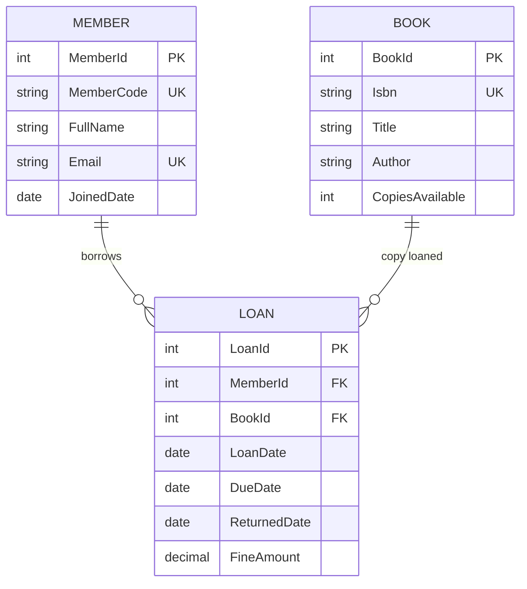
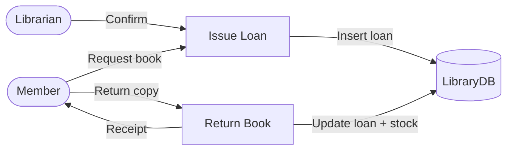

# 11 — Capstone: Library Database System

This project combines **ERD**, **DDL**, **queries**, **security**, and **performance** from the full curriculum.

---

## Business rules

- A **Member** can borrow many **Books** over time.
- Each **Loan** is one book to one member with due date and return date.
- A book copy has one **ISBN** and optional **status** (Available, OnLoan, Lost).
- Fines apply if returned after due date (simple flat fine in this lab).

---

## ERD



---

## Level 1 data flow



---

## Implementation

Run: **[sql/11-capstone-library-database.sql](../sql/11-capstone-library-database.sql)**

---

## Practice tasks

1. List all books currently on loan (no `ReturnedDate`).
2. Members with overdue loans (`DueDate < today` and not returned).
3. Create login `Library_ReadOnly` with SELECT only on `library` schema tables.
4. Add nonclustered index on `Loan(DueDate)` — run a before/after plan on overdue query.
5. Draw your own DFD Level 2 for **Return Book** process.

---

## Sample solutions

```sql
USE LibraryDB;

-- Books on loan
SELECT b.Title, m.FullName, l.LoanDate, l.DueDate
FROM library.Loan l
INNER JOIN library.Book b ON b.BookId = l.BookId
INNER JOIN library.Member m ON m.MemberId = l.MemberId
WHERE l.ReturnedDate IS NULL;

-- Overdue
SELECT m.FullName, b.Title, l.DueDate
FROM library.Loan l
INNER JOIN library.Member m ON m.MemberId = l.MemberId
INNER JOIN library.Book b ON b.BookId = l.BookId
WHERE l.ReturnedDate IS NULL AND l.DueDate < CAST(GETDATE() AS DATE);
```

---

## Next after capstone

- Module 3: `docs/03-server-management.md` + backup folder for `LibraryDB`
- Module 5: `sql/08-security-setup.sql` (adapt for Library_ReadOnly)
- Module 10: `sql/10-performance-tuning.sql` concepts on `library.Loan`
