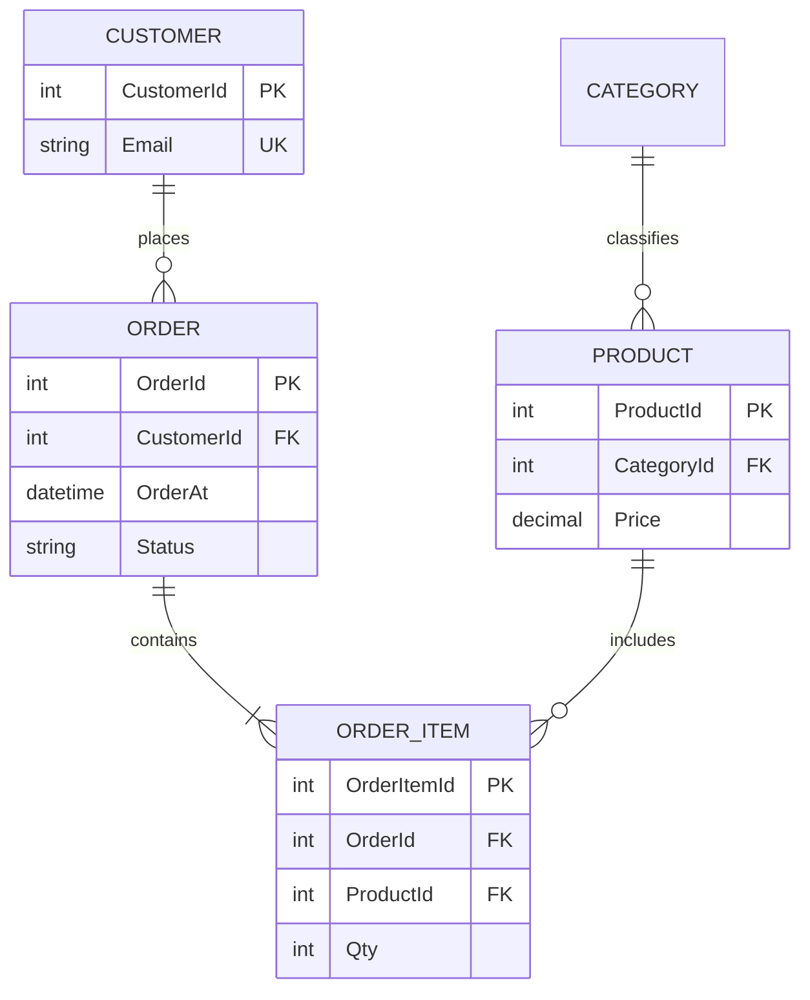
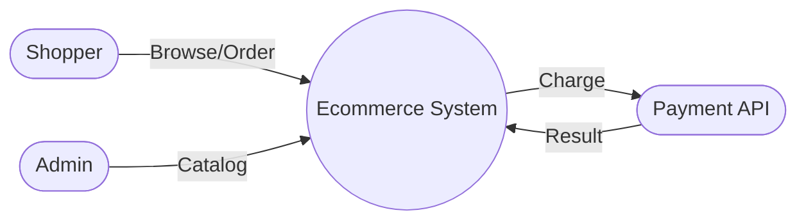

# 14 — Capstone: E-Commerce Database

> **SQL:** [sql/projects/ecommerce-full.sql](../sql/projects/ecommerce-full.sql) | **Modules used:** 02–10, 09

## ERD



## Level 0 DFD



## Run

1. Execute `sql/projects/ecommerce-full.sql`
2. Run reports at end of script
3. Add index on `shop.Order(CustomerId, OrderAt)` — compare plan before/after
4. Create role `Ecom_ReadOnly` with SELECT on `shop` schema
5. Backup `EcommerceDB` to `C:\Temp\SqlBackups`

## Tasks

| # | Task |
|---|------|
| 1 | Top 5 products by revenue |
| 2 | Customers with abandoned carts (no orders) — optional if no cart table |
| 3 | Orders last 30 days by status |
| 4 | Production runbook one-pager |
| 5 | One Extended Events capture on hot query |

## Solutions (sample)

```sql
USE EcommerceDB;
SELECT TOP 5 p.Name, SUM(oi.Qty * oi.UnitPrice) AS Revenue
FROM shop.Product p
JOIN shop.OrderItem oi ON oi.ProductId = p.ProductId
GROUP BY p.Name ORDER BY Revenue DESC;
```
