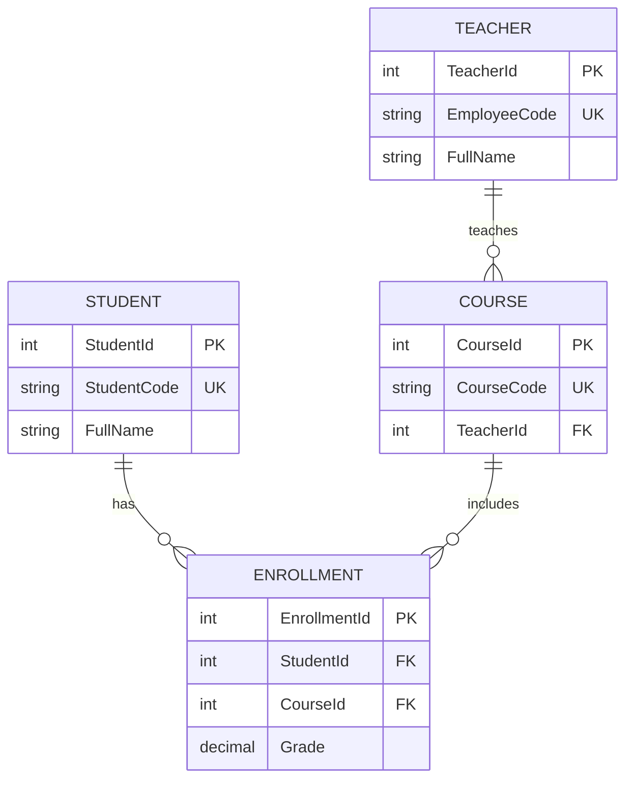

# School Management Database — Bonus Project

Practice everything after the main course with a **SchoolDB** schema.

---

## ERD



---

## Run

```text
sql/18-school-database.sql
```

---

## Your tasks

1. List students in course **CS101**
2. Average grade per course
3. Teachers with no courses (`LEFT JOIN`)
4. Add role `School_ReportReader` — SELECT only on views
5. Draw Level 0 DFD: Student, Registrar, School System

---

## Solutions (try first)

<details>
<summary>Show</summary>

```sql
-- Students in CS101
SELECT s.FullName, e.Grade
FROM school.Student s
JOIN school.Enrollment e ON e.StudentId = s.StudentId
JOIN school.Course c ON c.CourseId = e.CourseId
WHERE c.CourseCode = N'CS101';

-- Avg grade per course
SELECT c.CourseCode, AVG(e.Grade) AS AvgGrade
FROM school.Course c
JOIN school.Enrollment e ON e.CourseId = c.CourseId
GROUP BY c.CourseCode;
```

</details>
