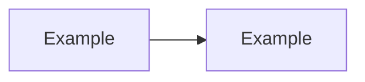

# Module Documentation Template

Copy this structure when authoring or expanding a module.

---

# NN — Module Title

> **Part:** I Foundations | II Developer | III DBA | IV Advanced  
> **Week:** N | **SQL scripts:** `sql/...` | **Exercises:** [exercises/module-NN.md](../exercises/module-NN.md)

## Learning outcomes

After this module you can:

1. …
2. …
3. …

## Concepts

### Subtopic 1

Explanation with diagram if helpful.



### Subtopic 2

…

## SSMS walkthrough

| Step | Action |
|------|--------|
| 1 | … |
| 2 | … |

## T-SQL examples

Run in SSMS (dev only). Full script: [sql/NN-name.sql](../sql/NN-name.sql)

```sql
-- Minimal inline example
SELECT 1;
```

## Common mistakes

| Mistake | Fix |
|---------|-----|
| … | … |

## Exercises

See [exercises/module-NN.md](../exercises/module-NN.md). Solutions: [exercises/solutions/module-NN.md](../exercises/solutions/module-NN.md).

## Further reading

- [Microsoft Learn — topic](https://learn.microsoft.com/en-us/sql/)

## Next module

Link to next doc.

---

## Author checklist

- [ ] Learning outcomes are measurable  
- [ ] At least one mermaid diagram  
- [ ] Linked SQL script exists and runs on LearnSQL  
- [ ] 3+ exercises with solutions  
- [ ] Production warning on destructive scripts  
- [ ] Version note for 2019+ / 2022+ features if used  
