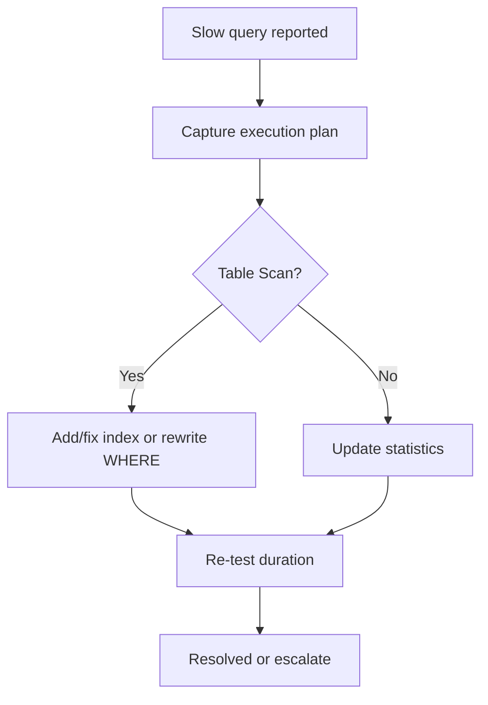

# Appendix C — Troubleshooting Flowcharts

## Slow query

**Scripts:** [10-performance-tuning.sql](../../sql/10-performance-tuning.sql), [17-module09-10-performance-lab.sql](../../sql/17-module09-10-performance-lab.sql)

## Blocking

1. `SELECT * FROM sys.dm_exec_requests WHERE blocking_session_id <> 0`
2. Find head blocker session; review `sys.dm_exec_sql_text`
3. Short-term: `KILL` only if approved
4. Long-term: index, query rewrite, isolation review

## Disk full

1. Check data/log/autogrowth on affected DB (`sys.master_files`)
2. Backup log if FULL recovery and log huge
3. Add disk or shrink only after root cause understood (avoid shrink loop)

## Backup failure

1. Read error log / Agent job history
2. Verify path permissions and disk space
3. Test `BACKUP DATABASE` to local folder manually
4. Restore drill on copy

## Connection failures

1. Ping/TCP port 1433 (or instance port)
2. SQL Browser for named instances
3. Firewall + `TCP/IP` enabled in SQL Server Configuration Manager
4. Authentication mode matches connection string
