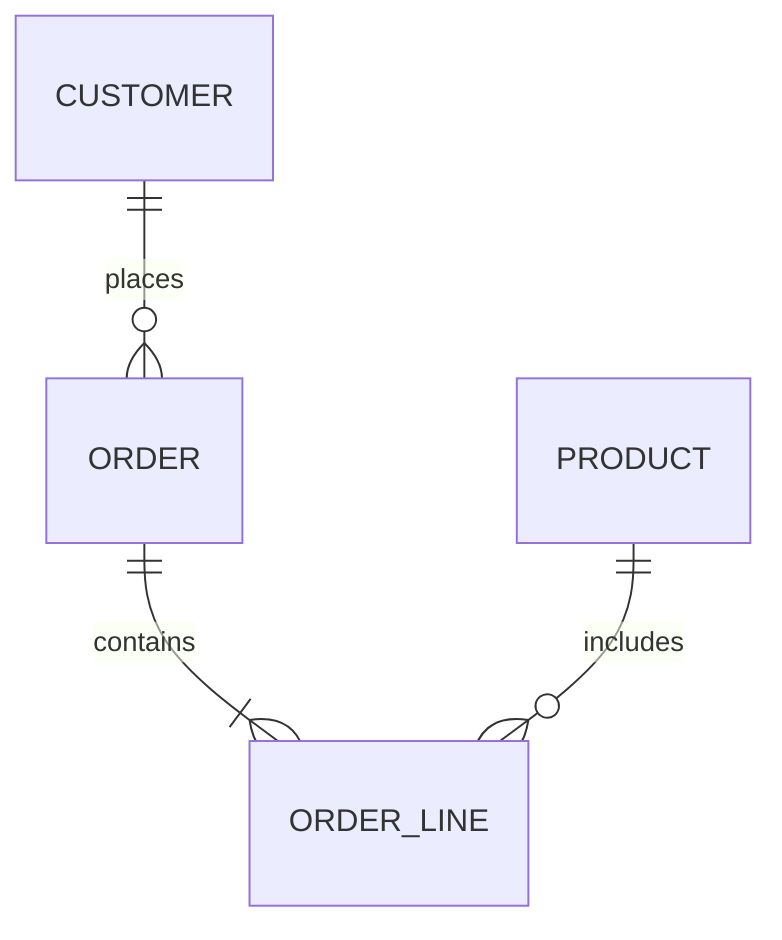

# 03 — Data Modeling, ERD & Data Flow

> **Part:** I Foundations | **SQL:** 11, 16 | **Workbook:** [13-design-workbook.md](../13-design-workbook.md)

## Learning outcomes

1. Draw conceptual ERD with correct cardinality  
2. Normalize tables to 3NF  
3. Map ERD to DDL with PK/FK constraints  
4. Draw context and Level 1 DFD  
5. Relate DFD processes to stored procedures and databases  

## Concepts

This module consolidates:

- [07-database-design-erd.md](../07-database-design-erd.md) — ERD, normal forms, keys  
- [08-data-flow-architecture.md](../08-data-flow-architecture.md) — DFD, scalability patterns  



## Design process

```
Requirements → Conceptual ERD → Logical tables → Physical DDL + indexes → Validate
```

## SSMS walkthrough

| Step | Action |
|------|--------|
| 1 | Database Diagrams (small schemas): right-click database → Database Diagrams |
| 2 | Prefer version-controlled T-SQL DDL for production |
| 3 | Run `sql/11-capstone-library-database.sql` and compare to ERD in doc 11 |

## Common mistakes

| Mistake | Fix |
|---------|-----|
| M:N without junction table | Add associative entity (e.g. OrderLine) |
| Natural key only | Add surrogate PK + UNIQUE on business key |
| Denormalize without reason | Document read-performance trade-off |

## Exercises

- [exercises/module-03.md](../../exercises/module-03.md)  
- [13-design-workbook.md](../13-design-workbook.md)  

## Capstone labs

| Project | Script |
|---------|--------|
| Library | [sql/11](../../sql/11-capstone-library-database.sql) |
| Hospital | [sql/16](../../sql/16-module07-08-design-lab.sql) |

## Next

[04 — Advanced T-SQL](../04-advanced-developer.md)
