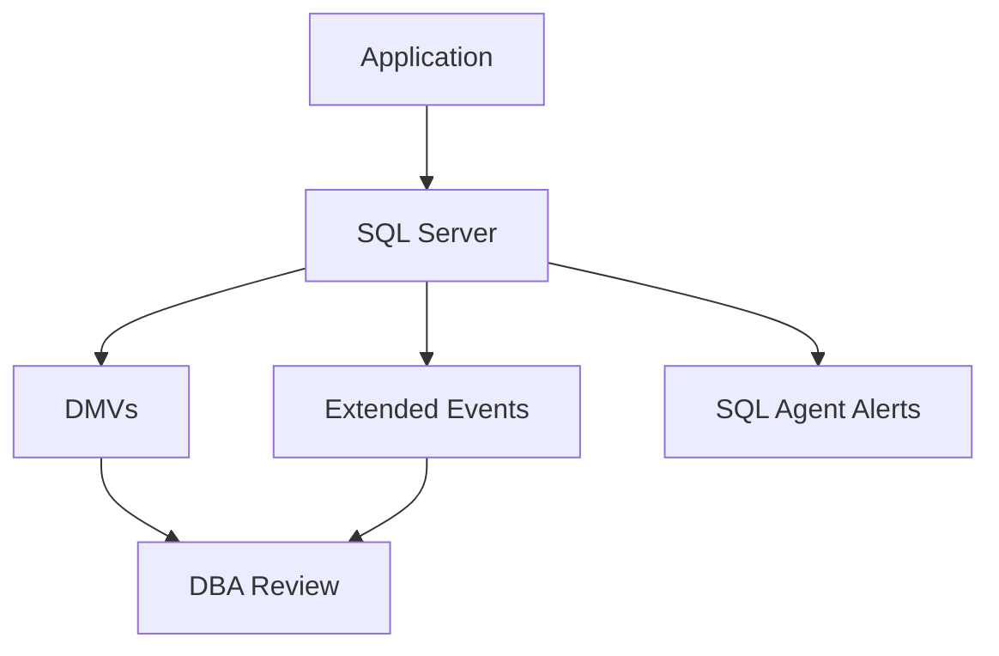

# 10 — Monitoring & Troubleshooting

> **Part:** III DBA | **SQL:** [19-extended-events-lab.sql](../../sql/19-extended-events-lab.sql) | **Appendix:** [A-dmv-reference.md](../appendices/A-dmv-reference.md), [C-troubleshooting.md](../appendices/C-troubleshooting.md) | **Exercises:** [module-10](../../exercises/module-10.md)

## Learning outcomes

1. Use DMVs for sessions, requests, waits, and indexes  
2. Diagnose blocking and deadlocks  
3. Create an Extended Events session for completed queries  
4. Establish a performance baseline methodology  

## Monitoring stack



## Key DMVs

| DMV | Purpose |
|-----|---------|
| `sys.dm_exec_sessions` | Who is connected |
| `sys.dm_exec_requests` | Active requests, blocking |
| `sys.dm_os_wait_stats` | Server-wide wait accumulation |
| `sys.dm_db_index_usage_stats` | Index use since restart |
| `sys.dm_db_missing_index_details` | Tuning suggestions |

## Blocking

```sql
SELECT r.session_id, r.blocking_session_id, r.wait_type, r.wait_time,
       t.text
FROM sys.dm_exec_requests r
CROSS APPLY sys.dm_exec_sql_text(r.sql_handle) t
WHERE r.blocking_session_id <> 0;
```

Kill only as last resort: `KILL <session_id>;`

## Deadlocks

- SQL Server picks a **victim** and rolls back one transaction  
- Trace flag 1222 logs to error log (advanced)  
- Prefer: consistent table access order, shorter transactions, indexes  

## Extended Events

Lab: [sql/19-extended-events-lab.sql](../../sql/19-extended-events-lab.sql)

Prefer XE over SQL Profiler for production-style captures.

## Baseline methodology

1. Record wait stats, batch/sec, P95 query duration under normal load  
2. Change one thing (index, query, config)  
3. Re-measure same window  

## Common mistakes

| Mistake | Fix |
|---------|-----|
| Restarting server to "fix" blocking | Find root query; index or rewrite |
| Clearing wait stats casually | `DBCC SQLPERF('sys.dm_os_wait_stats', -1)` only when taking new baseline |
| Missing backups while debugging | Back up before major changes |

## SSMS walkthrough

| Step | Action |
|------|--------|
| 1 | Right-click instance → Reports → Standard Reports → Activity |
| 2 | Management → Extended Events → New Session Wizard |
| 3 | sp_Blitz / monitoring tools optional for real jobs |

## Exercises

[exercises/module-10.md](../../exercises/module-10.md)

## Next

[11 — High availability](../part-04-advanced/11-high-availability.md)
