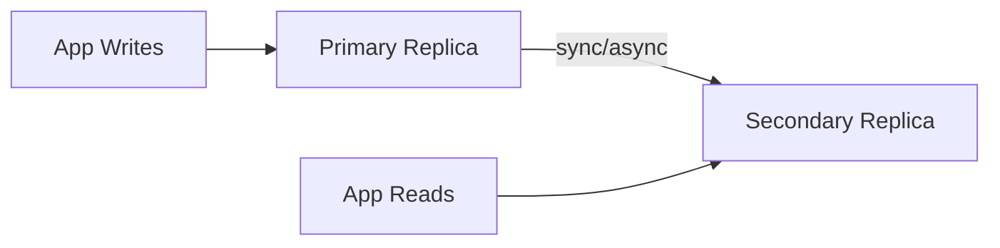

# 11 — High Availability & Scale-Out

> **Part:** IV Advanced | **SQL:** [23-ha-concepts-readonly.sql](../../sql/23-ha-concepts-readonly.sql) | **Exercises:** [module-11](../../exercises/module-11.md)

## Learning outcomes

1. Compare Always On AG, log shipping, and replication  
2. Explain read-scale with secondary replicas  
3. Describe table partitioning benefits  
4. Map RPO/RTO to HA technology choices  

## HA options

| Technology | RPO typical | Failover | Read scale |
|------------|-------------|----------|------------|
| **Always On AG** | Low with sync | Automatic (cluster) | Yes (secondary) |
| **Log shipping** | Minutes | Manual | Standby read (limited) |
| **Transactional replication** | Seconds–minutes | Manual | Subscribers read |
| **Failover Cluster Instance** | Instance level | Node failover | No |

## Always On (conceptual)

- **Availability Group** — group of databases failing over together  
- **Listener** — virtual name apps connect to  
- **Synchronization:** synchronous (zero data loss target) vs asynchronous  

## Read scale-out

Route reporting to `ApplicationIntent=ReadOnly` secondary (driver support required).

## Partitioning

Split large tables by range (e.g. year) for maintenance and scan reduction — see doc 09.

## Common mistakes

| Mistake | Fix |
|---------|-----|
| AG without quorum planning | Test failover quarterly |
| Backups only on secondary without copy | Run backups per policy on appropriate node |
| Replication for HA only | Replication is not full HA substitute |

## Lab

Read-only: [sql/23-ha-concepts-readonly.sql](../../sql/23-ha-concepts-readonly.sql) — AG DMVs if Enterprise/Developer with AG.

## Further reading

- [Always On availability groups](https://learn.microsoft.com/en-us/sql/database-engine/availability-groups/windows/overview-of-always-on-availability-groups-sql-server)

## Next

[12 — Automation](12-automation.md)
