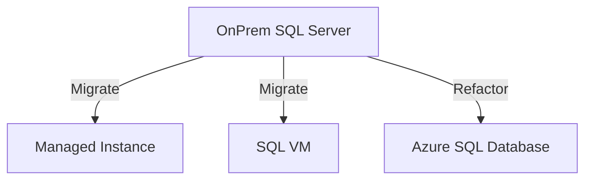

# 13 — Azure SQL & Hybrid

> **Part:** IV Advanced | **Conceptual** — no Azure subscription required | **Exercises:** [module-13](../../exercises/module-13.md)

## Learning outcomes

1. Compare Azure SQL Database, SQL VM, and Managed Instance  
2. Choose migration path from on-premises SQL Server  
3. Understand elastic pools and DTU/vCore models at high level  

## Azure options

| Service | You manage | Best for |
|---------|------------|----------|
| **Azure SQL Database** | Almost nothing (PaaS single DB) | New cloud apps |
| **SQL Server on VM** | OS + SQL (IaaS) | Lift-and-shift |
| **Azure SQL Managed Instance** | Near-full SQL instance, VNet | Enterprise migration |

## Connectivity

- Firewall rules / private endpoint  
- **Entra ID (Azure AD)** authentication for Azure SQL  
- TLS required  

## Migration tools (overview)

- Data Migration Assistant (DMA) — compatibility assessment  
- Azure Database Migration Service  
- Backup/restore to URL (blob) for some paths  

## Hybrid

- **Linked server** to on-prem from Azure (limited scenarios)  
- **Replication / AG** distributed availability (advanced)  

## Cost awareness

- DTU model — bundled compute/storage tiers  
- vCore model — separate compute and storage scaling  
- **Elastic pool** — share resources across many small databases  

## Common mistakes

| Mistake | Fix |
|---------|-----|
| Assuming all on-prem features exist in SQL Database | Check feature compatibility (DMA) |
| No DR region | Configure geo-redundant backup / failover group |

## Further reading

- [Azure SQL documentation](https://learn.microsoft.com/en-us/azure/azure-sql/)

## Next

[14 — Capstones](../11-capstone-library-project.md)
